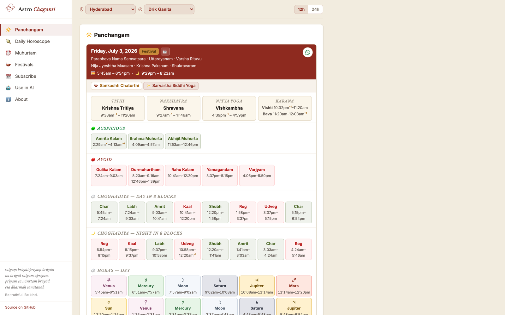
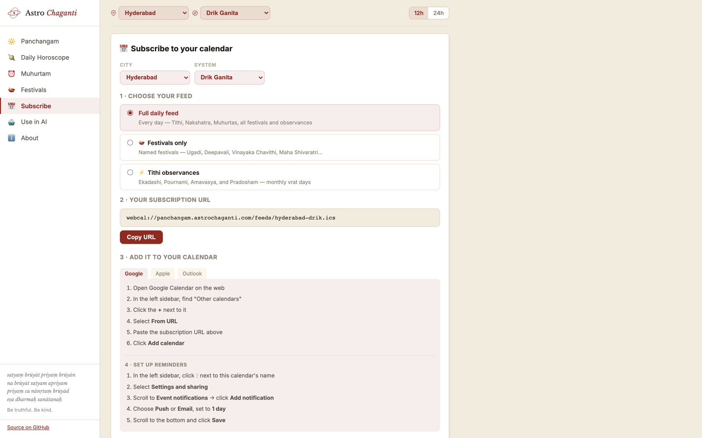

# Telugu Panchangam Calendar Feeds

Subscribable Telugu Panchangam feeds for 22 cities — delivered as `.ics` files you can add to Google Calendar, Apple Calendar, or Outlook.

Every day appears as an all-day event (no calendar blocking) with full Panchangam details in the description. Festival days — Ugadi, Vinayaka Chavithi, Deepavali, Maha Shivaratri, the Sankranti cluster, and 30+ more — are marked with 🪔 in the title; other special days (Ekadashi, Amavasya, Pournami, Pradosham, Sankranti, Eclipses) with ⚡.



## Subscribe

Visit the landing page to pick your city and calculation system and copy your `webcal://` URL:

**[panchangam.astrochaganti.com](https://panchangam.astrochaganti.com)**

The site is also a daily toolkit: **Today's Panchangam** (any date, any city), **Tarabalam · Muhurtam**
(good days and ranked time slots for up to four people by birth star, with Chandrabalam), and the
**Gochara chart with Rasi Phalalu** (South Indian chart, transit verdicts and a computed daily reading).
Everything is shareable to WhatsApp.

<details>
<summary>What subscribing looks like</summary>



</details>

## What's in each day's event

- **Metadata** — Samvatsara, Maasam, Paksham, Vaaram, solar and lunar signs
- **Pancha Anga** — Tithi, Nakshatra, Yoga, Karana with start/end times
- **Sky markers** — Sunrise, Sunset, Moonrise, Moonset
- **Auspicious windows** — Brahma Muhurta, Abhijit Muhurta, Amrita Kalam
- **Inauspicious windows** — Rahu Kalam, Gulika Kalam, Yamagandam, Varjyam, Durmuhurtham
- **Choghadiya** — 8 day blocks with names
- **Eclipses** — Solar and lunar eclipses with type (Total/Partial/Annular/Penumbral), visibility from your city, eclipse window, and Sutak period
- **Special Yogas** — Sarvartha Siddhi, Amrita Siddhi, Visha, and Dagdha yogas based on weekday/tithi/nakshatra combination

## Cities

**Telugu Heartland** — Hyderabad, Vijayawada, Visakhapatnam, Tirupati, Warangal, Guntur, Nizamabad, Rajahmundry, Kurnool, Nellore

**Major Indian Metros** — Bengaluru, Chennai, Mumbai, Delhi

**International Diaspora** — Dallas, San Jose, San Francisco, Edison (NJ), New York, London, Sydney, Dubai

## Calculation Systems

| System | Basis | Best for |
|--------|-------|----------|
| **Drik Ganita** | Swiss Ephemeris (pyswisseph) — supports Lahiri, Raman, Krishnamurti, True Chitrapaksha ayanamsas | Modern apps, accurate sky events |
| **Surya Siddhanta** | Mean-motion algorithms from classical SS text | Traditions rooted in classical siddhantic calculation |
| **Vakya** | Surya Siddhanta + published correction tables | Traditional Telugu/Tamil printed Panchangams |

## MCP Server

`mcp-server-panchangam` is available on PyPI. It's a standard MCP stdio server (`uvx mcp-server-panchangam`), so it works with any MCP-compatible client or agent — Claude Desktop, Claude Code, Cursor, Windsurf, and custom agents built on the MCP SDK. Below are examples for a couple of common clients; for others, point your client's MCP config at the same `uvx mcp-server-panchangam` command.

**Claude Desktop** — add to `~/Library/Application Support/Claude/claude_desktop_config.json`:

```json
{
  "mcpServers": {
    "panchangam": {
      "command": "uvx",
      "args": ["mcp-server-panchangam"]
    }
  }
}
```

**Claude Code** — run once:

```bash
claude mcp add panchangam -- uvx mcp-server-panchangam
```

### Available tools

**Daily Panchangam**

| Tool | Description |
|------|-------------|
| `get_panchangam` | Full Panchangam for any date and city |
| `get_muhurta` | One day's auspicious/inauspicious windows (lighter call; use `find_muhurta` to search across days) |
| `get_panchanga_shuddhi` | Five-limb purity verdict (Sarva Shuddha → Sarva Ashuddha) with per-limb quality and reason |

**Planning across days**

| Tool | Description |
|------|-------------|
| `get_panchangam_range` | Compact Panchangam summary for each day in a range (max 31 days) |
| `get_special_days` | Named festivals, Ekadashi, Amavasya, Pournami, Pradosham, Sankranti, and Eclipses for a month |
| `find_muhurta` | Ranked auspicious time slots — activity-aware, every slot with its reasons |
| `find_tarabalam_days` | Tarabalam & Chandrabalam — days favourable for 1–4 people by birth star (and rashi) |

**Sky events**

| Tool | Description |
|------|-------------|
| `get_combustion_calendar` | Asta/Udaya (combustion entry/exit) periods for Mercury, Venus, Mars, Jupiter, Saturn |
| `get_graha_yuddha` | Graha Yuddha (planetary war) periods — winner, loser, timing in UTC |
| `get_rashi_ingresses` | All rashi sign-change events for the classical planets over a date range |
| `get_eclipse_calendar` | Solar and lunar eclipses with per-city visibility and Sutak timing |

**Gochara and personal transits**

| Tool | Description |
|------|-------------|
| `get_graha_positions` | All nine grahas at sunrise — rasi, nakshatra, retrograde, next-rasi dates |
| `get_gochara` | Gochara verdicts from a janma rashi — houses, vedha, Sade Sati / Ashtama Shani |
| `get_rasi_phalalu` | Deterministic daily reading rendered from computed facts |

**Intraday timing**

| Tool | Description |
|------|-------------|
| `get_daily_horas` | 24 planetary hours (horas) for the day, starting at sunrise with the weekday lord |
| `get_lagna_transitions` | Ascendant (Lagna) sign boundaries tracking the eastern horizon across the day |

**Utility**

| Tool | Description |
|------|-------------|
| `list_supported_cities` | 22 pre-configured cities with lat/lon/timezone |

All tools accept any free-text city name. Pre-configured cities resolve instantly; any other city is geocoded via OpenStreetMap. You can also pass `latitude`, `longitude`, and `timezone` directly.

Drik-system tools that accept a `city` or date also accept `ayanamsa=lahiri|raman|krishnamurti|true_chitrapaksha` (default: `lahiri`). Full API documentation and parameter details: [mcp-server-panchangam on PyPI](https://pypi.org/project/mcp-server-panchangam/).

## How it works

Feeds are generated on the 1st of every month via GitHub Actions, covering 18 months ahead. They are served as static `.ics` files from GitHub Pages — zero hosting cost.

```
GitHub Actions (monthly cron)
  → python -m telugu_panchangam.generate   (22 cities × 3 systems = 66 feeds)
  → feeds/*.ics
  → GitHub Pages (webcal:// subscriptions)
```

## Maintenance and roadmap

The active maintenance queue is the
**[Telugu Calendar Utilities GitHub Project](https://github.com/users/socraticsurge/projects/2)**.
Use the linked status and priority fields to see what is planned, in progress,
or ready for review. File defects and feature proposals in
**[repository Issues](https://github.com/socraticsurge/telugu-calendar-utilities/issues)**.

The CSV files and phase plans under `docs/tracking/` are preserved historical
records; they are not a second backlog.

## Development

```bash
python -m venv .venv && source .venv/bin/activate
pip install -r requirements.txt
npm install
python tools/verify_project.py
python -m telugu_panchangam.generate   # writes to feeds/
```
