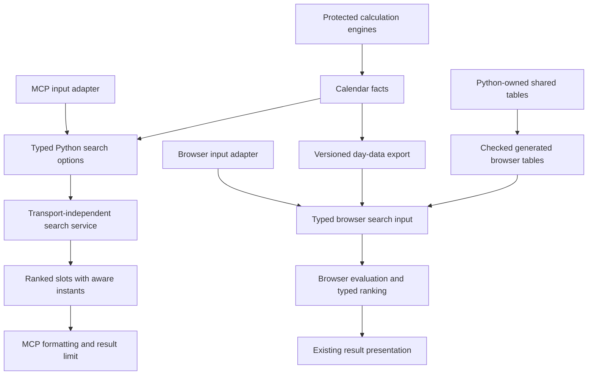

# ADR 0003: Incremental calculation-boundary repair

Status: repair merged; production pilot enabled through `.env.production` after sidecar publication is verified.
Owner approval: architecture repair and structural inventory-test updates approved.
Baseline: `e05eb3ba32be613e53832092588e996bb56558fe`.

## Decision

Keep the verified behavior, existing subscriber format and protected engines.
Replace responsibilities at their boundaries, rather than pursue a whole-project rewrite.
This is a scoped repair, not a claim that every browser panel is now strictly typed.

The arrows describe responsibility and data flow, not a new shared runtime.
The browser and Python implementations remain distinct.

### Browser Tara/Chandra boundary

`src/scorer/tara-chandra.ts` owns the five shared browser Tara/Chandra helpers.
Scoring and day-rule evaluation import it directly, rather than importing the
UI journey. The journey retains its original exports as compatibility re-exports.
Calculations still execute in the browser; no server, request or data transfer is added.

The pure module is strictly type-checked and tested without a browser environment.
Compatibility tests cover all 729 star pairs and 144 sign pairs, invalid names and
out-of-range values. A dependency guard checks the module's dependency graph for
UI, browser storage and network access, and pins the two direct scoring consumers.
UI rendering, stored mode selection, calculation policies and Python engines are unchanged.

## Completed repair sequence

1. Pin shared ranking boundaries with one hand-authored corpus consumed by both runtimes.
   Preserve MCP signatures and byte-level results with a baseline corpus.
   Define explicit browser inputs and Python search/result contracts.
2. Move multi-day search, night handling, diagnostics and ranking out of MCP formatting.
   Return all raw candidates with timezone-aware instants; the MCP adapter formats and limits them.
   Replace mutation of caller-owned score explanation buckets with returned contributions.
   Move browser ranking into the strictly checked calculation area.
3. Export the seven audited manual table/contract groups from their existing Python owners.
   Validate the generated artifact in the full Python gate.
   Preserve the browser's historical Yoga aliases and supported-rule subset.
4. Generate `.days-v1.json` beside the unmodified `.ics` feeds.
   Validate version, city, system, timezone and nested field types before using data.
   Migrate Today and the Muhurta day pipeline to the day-data adapter.
   Keep the legacy reader as a compatibility fallback during the pilot.

## Contracts intentionally not unified

- MCP accepts at most 14 days and presents at most 12 slots.
- Browser search retains its 60-day cap, personal-preference tie-break and chart screening.
- Python has 35 canonical activity profiles; the browser exposes its existing 30-profile subset.
- The browser's approximate Yoga names retain Priti/Shula/Variyana.
- Night slot tie-breaks retain local-clock ordering, rather than silently switching to UTC order.
- Generated day views retain minute precision and the old relative-date markers.
- ICS summaries/descriptions remain opaque display/legacy strings in the sidecar.
  Structured facts are projected from engine objects, never reconstructed from those strings.
- Domain source claims and rule semantics are unchanged; engine-pinned fixtures are not independent astronomical verification.

## Verification and material change tests

- `tests/test_muhurta_ranking_contract.py` and the matching frontend test share independent expected boundaries.
- `tests/test_muhurta_mcp_compatibility.py` pins the original signature and nine complete serialized responses/errors.
- `tests/test_muhurta_search_boundary.py` proves the service returns unformatted, untruncated results without MCP imports.
- `tests/test_shared_calendar_tables.py` rejects generator drift and pins intentional aliases.
- The 48-day structured-data corpus covers three systems, two cities, an eclipse, DST and cross-midnight data.
- `src/__tests__/calendar-data.test.ts` replaces description wording while asserting unchanged structured facts.
- `tests/test_structured_calendar_browser.py` exercises the built Today and Muhurta journeys at mobile and desktop widths.
- Existing behavioral assertions and coverage thresholds remain; only structural/release metadata and loader mocking change.
- Architecture tests compare a committed revision against its own committed inventory ledger, avoiding pre/post-commit count mismatches.

## Rollout and rollback

The repair landed with the pilot disabled; the activation release sets the flag
in `.env.production` only after verifying published sidecars for every city/system.
This separates feed publication from activation without changing workflows or CNAME.

1. Generate feeds with the existing `python -m telugu_panchangam.generate` entry point.
   The existing feed-publication script copies both ICS and day JSON; workflows and CNAME remain untouched.
2. Verify sidecars for the supported city/system combinations before enabling the public build.
3. Set `VITE_STRUCTURED_CALENDAR_ENABLED=true` for the browser build to activate the pilot.
   An explicit `false` disables it, including local query overrides.
4. For local browser inspection only, use `?calendarData=structured#today` or `#tarabalam` on loopback.
5. Roll back by building with the flag disabled; subscriber feeds and stored profiles are unchanged.

The production flag is committed in `.env.production`; ordinary production builds
therefore preserve activation during future feed regeneration. A flag-only change
does not match the landing workflow's path filter: dispatch `deploy-landing.yml`
after merging it and verify the published asset. Do not change workflow protections.

The legacy browser suite builds with an explicit `false` flag, preserving its
offline ICS fixtures. The separate structured browser suite builds with `true`
and uses ordinary URLs without query overrides. It verifies Today and Muhurta
at two viewport widths, plus missing, invalid and network-failure fallback.
The hosted frontend job runs both suites as separate required steps, rebuilding
for each flag setting. A workflow contract test prevents silently dropping or
making the enabled-pilot step optional. This CI-only update was separately approved;
deployment workflows, permissions and CNAME remain unchanged.

The full September 2026 generation covers 22 cities, three systems and 36,102 days.
Every structured day was compared with the existing description parser.
This proves compatibility, not independent astronomical accuracy or faster downloads.

No public activation, workflow dispatch or feed publication is implied by local verification.
Broad replacement of remaining panels, engine unification and API feature parity are outside this repair.

## Residual Tithi and Karana vocabulary (#184)

The schema-1 shared calendar artifact now also projects the existing Python-owned
Tithi and Karana vocabulary without changing any calculation or scoring rule:

| Export | Python owner | Browser consumers |
| --- | --- | --- |
| `tithiNames` | `panchangam_names.TITHI_NAMES` | Slot-time facts and Homa ordinal lookup |
| `tithiWithinPakshaNames` | `personal.tithi_class.TITHI_NAMES` | Activity ordinal and Tithi-family lookup |
| `tithiAliases` | `personal.tithi_class._ALIASES` | Both last-word input classifiers |
| `karanaRepeating`, `karanaFixed` | `panchangam_names.KARANA_REPEATING`, `KARANA_FIXED` | Slot-time Karana lookup |

The 30 full Tithi names and 15 within-paksha names are distinct contracts.
`Pournami` and `Amavasya` retain their existing terminal positions; all four
input aliases and named Ekadashi suffixes remain accepted. JSON object keys for
fixed Karanas are strings on disk, with unchanged JavaScript numeric indexing.
These fields are additive under schema version 1; removals, reordering, or changed
semantics require an explicit compatibility decision, not silent regeneration.

The browser's numeric Tithi-family rule remains an intentional algorithm mirror,
not vocabulary ownership. Its outputs are checked for all 30 names and aliases.
The astronomical formulae and their half-Tithi index calculation remain unchanged.
The 60-row fixture records existing browser outputs from master `8938755`, sampled
at three-hour intervals during January/February 2026 until every half-Tithi index
was present. It protects migration behavior, not independent astronomical accuracy;
selected-engine correctness is separate work in #182. Python checks every fixture
name against canonical owners, and Vitest checks the complete existing browser
output at each captured instant. The existing stale-artifact test still requires
an exact match to the exporter.
