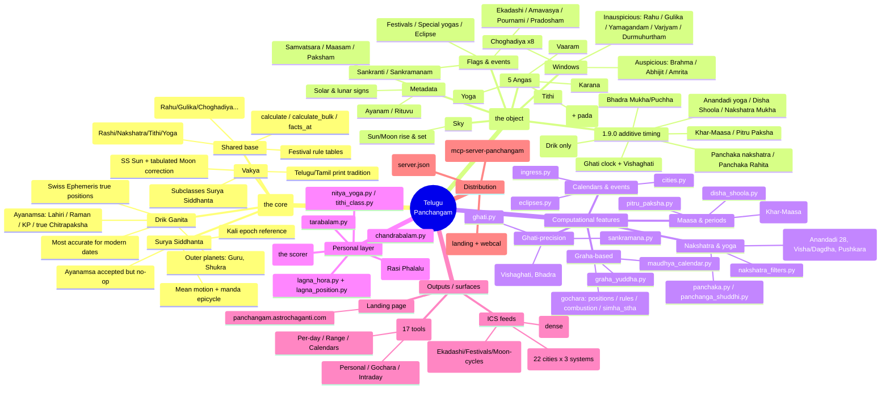
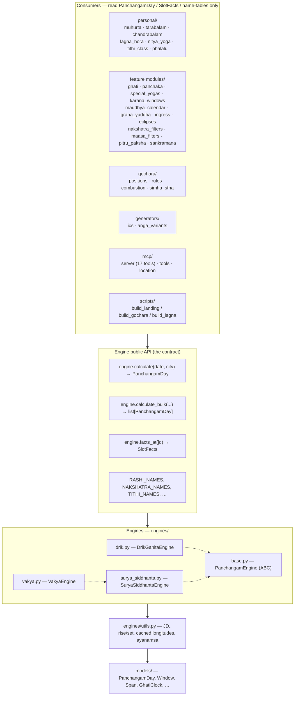
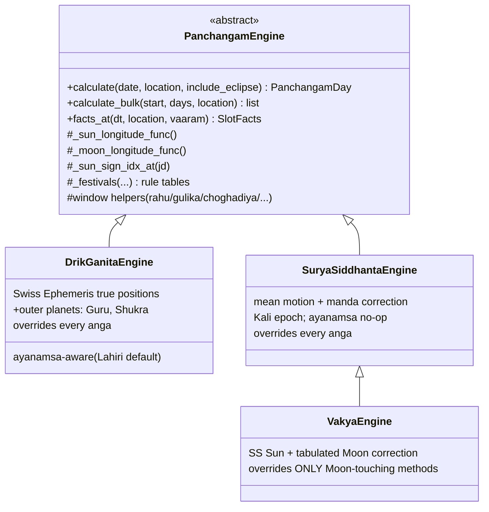

# 01 · System Mindmap & Architecture

The whole project on a few screens. Start with the mindmap for breadth, then the
layer-cake for *where code lives*, then the class hierarchy for *how the engines
relate*.

---

## The deep mindmap

Everything the project is, from the engine core out to the three distribution
surfaces. (If your viewer doesn't render Mermaid mindmaps, the same tree is in
the indented list below it.)

### Same tree, as text

- **Engines (the core)** — `telugu_panchangam/engines/`
  - **Drik Ganita** — Swiss Ephemeris true positions; 4 ayanamsas; computes outer
    planets (Guru/Shukra); most accurate for modern dates.
  - **Surya Siddhanta** — classical mean-motion + manda correction; Kali epoch;
    ayanamsa is a no-op.
  - **Vakya** — SS Sun + a tabulated Moon correction; subclasses SS; print tradition.
  - **Shared base** — `calculate()`, `calculate_bulk()`, `facts_at()`, festival
    rule tables, window helpers, name tables.
- **`PanchangamDay`** — the one canonical output object (see [doc 02](02-engines-and-model.md)).
- **Computational features** — standalone jyotisha modules consuming engine output
  (see [doc 03](03-computational-features.md)).
- **Personal layer** — per-person scoring & readings (see [doc 05](05-data-flow-and-muhurta.md)).
- **Outputs/surfaces** — ICS feeds, MCP server (17 tools), landing page (see [doc 04](04-user-facing-features.md)).
- **Distribution** — GitHub Pages, PyPI, MCP registry.

---

## The layer cake (where code lives)

Consumers read engine output; they never reach into engine internals. Only four
public entry points cross the line.

---

## Engine class hierarchy (the asymmetry)

The three engines are **not symmetric** — Vakya subclasses Surya Siddhanta and
only overrides the Moon-touching methods. This is the documented motivation for
the (currently parked) Phase 6 `EngineCore` unification.

> **Why it matters:** a fix to a shared helper in `SuryaSiddhantaEngine`
> silently changes Vakya, but the same fix in `DrikGanitaEngine` does not — and
> there's no warning when they drift. `_special_flags` is triplicated (Drik
> checks 3 sankranti points, SS checks 2). Tracked in
> [doc 06 — roadmap](06-roadmap-and-backlog.md).
