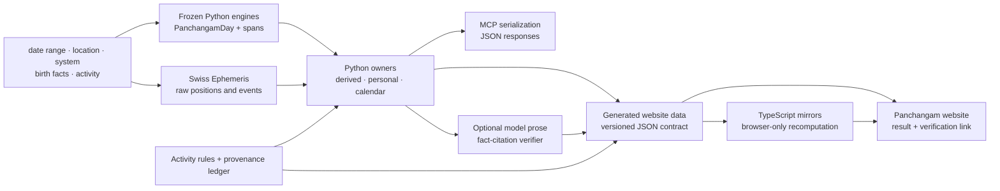
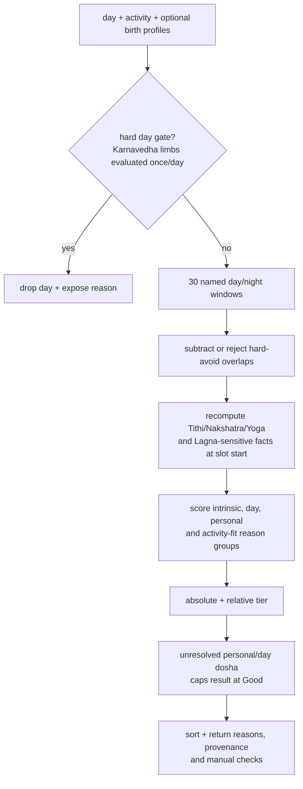

# 03 · Derived, Personal, Calendar and Browser Computations

This is the human-readable contract for every production computation outside
the three frozen Panchangam engines. The canonical machine-readable index is
[`computations.json`](computations.json); its scope and update rules are in the
[computation inventory](09-computation-inventory.md). Core engine formulas are
documented separately in [Engines and model](02-engines-and-model.md).

The tables below deliberately distinguish four things:

1. an astronomical or deterministic output;
2. a textual or regional classification applied to that output;
3. a project scoring or presentation heuristic; and
4. model-generated prose.

A passing regression test proves that the implementation is stable. It does
not, by itself, prove that a textual rule is authoritative or that an event has
been independently compared with a published Panchangam. Read the **evidence**
column with the vocabulary in [Provenance and authority](08-provenance-and-authority.md).

## Ownership and verification boundary

Python is the owner unless a row explicitly says otherwise. MCP serializes the
Python result; it is not a second algorithm. The browser either renders
generated Python data or runs a named TypeScript mirror. Parity tests compare
mirrors with Python fixtures, but the browser is not an independent external
verification source.

## Time, units and numerical conventions

- All ephemeris searches use Julian Day in UT/UTC internally. Public instants
  are timezone-aware datetimes or ISO strings.
- A Panchangam day begins at local sunrise. Day-snapshot classifications use
  that sunrise unless the row states that the fact is recomputed at slot time.
- `derived.ghati-clock` divides the actual local sunrise-to-next-sunrise span
  into 60 equal Ghatis; one Ghati is therefore proportional, not always 24
  civil minutes. One Vighati is 1/60 of that proportional Ghati.
- `personal.nitya-yoga-disposition` is an explicit exception: its partial
  dosha windows currently use the conventional fixed 24 civil minutes per
  Ghati (72–216 minutes), not the proportional `GhatiClock`.
- Angles are degrees in `[0, 360)`. Rashi spans are 30 degrees; Nakshatra spans
  are 360/27 degrees; Pada is one quarter of a Nakshatra.
- Numerical event searches bracket a state change and bisect it. Precision in
  the code is numerical precision, not a claim that the rule or input model is
  independently verified to that tolerance.
- Lagna transitions are a hybrid: Swiss tropical Ascendant minus Lahiri
  ayanamsa, even when the requested Panchangam system is Surya Siddhanta or
  Vakya. Their output is therefore engine-pinned, not a native result of those
  longitude systems.

## Derived day and slot computations

| Stable ID | Owner and algorithm | Inputs → outputs; time and units | Surfaces | Evidence and important boundary |
|---|---|---|---|---|
| `derived.ghati-clock` | `ghati.py`: divide sunrise→next sunrise by 60; convert civil instants, Ghatis and windows | Two local instants → seconds/Ghati, floating Ghati and civil windows | Python, MCP, website | Partially verified; proportional Ghati, not fixed civil minutes |
| `derived.vishaghati` | `karana_windows.py`: map each Nakshatra's configured offset into its observed span; width is four Vighatis; clip to the Panchangam day | Nakshatra spans + Ghati clock → civil and Ghati windows | Python, MCP, ICS, website | Partially verified; offset table is tradition-specific |
| `derived.bhadra-mukha-puchha` | `karana_windows.py`: choose Tithi/Yama quarters from the Vishti midpoint; widths are 5/30 and 3/30 of observed Vishti; clip to day bounds | Tithi + Vishti spans → Mukha and Puchha windows | Python, MCP, ICS, website | Verified claim `panchangam.bhadra_mukha_puchha`; no blending of conflicting tables |
| `derived.sankramana-avoidance` | `sankramana.py`: extend 16 proportional Ghatis before and after the exact solar ingress | Ingress instant + Ghati clock → start/end | Python, MCP, website | Verified textual rule; window is doctrine, not astronomical uncertainty; it is not clipped to one day |
| `derived.named-muhurtas` | `muhurtas.py`: divide day and night separately into 15 equal parts and attach the verified name/disposition table | Sunrise, sunset, next sunrise → 30 named windows | Python, website | Verified table; day/night durations vary with location and season |
| `derived.anandadi-yoga` | `special_yogas.py`: weekday offset into the 28-name Anandadi cycle using active Nakshatra | Vaaram + Nakshatra → one name | Python, MCP, ICS, website | `needs_locator`; named convention, not an observed astronomical quantity |
| `derived.special-yogas` | Exact Vaaram/Tithi/Nakshatra lookup tables for Sarvartha Siddhi, Amrita Siddhi, Siddha, Visha, Dagdha and Dvi/Tripushkara | Active limbs at day or slot → list of names | Python, MCP, ICS, website | `needs_locator`; Python/browser parity is tested |
| `derived.nakshatra-mukha` | `nakshatra_filters.py`: lookup Adho/Urdhva/Tiryan class | Active Nakshatra → class or null | Python, MCP, website | `needs_locator`; an activity input, not a universal day score |
| `derived.panchaka-nakshatra` | Membership in Dhanishtha, Shatabhisha, Purva Bhadrapada, Uttara Bhadrapada or Revati | Active Nakshatra → boolean | Python, MCP, website | `needs_locator`; current rule treats all of Dhanishtha, not only a half-star subdivision |
| `derived.panchaka-rahita` | `panchaka.py`: `(Tithi + Vaaram + Nakshatra + Lagna) mod 9`; map remainder to Rahita/Mrityu/Agni/Raja/Chora/Roga and activity cautions | Four 1-based ordinals → remainder, name, auspicious flag and cautions | Python, MCP, website | Verified `panchangam.panchaka_rahita`; sunrise field is recomputed with slot Lagna during ranking |
| `derived.panchanga-shuddhi` | `panchanga_shuddhi.py`: assess sunrise Tithi, Vaaram, Nakshatra, Yoga and first Karana; count passing limbs | `PanchangamDay` → five assessments, 0–5 count and verdict | Python, MCP | `needs_locator`; not a complete personal election chart |
| `derived.disha-shoola` | Weekday-to-direction lookup | Sunrise Vaaram → avoided travel direction | Python, MCP, website | `needs_locator`; lineage and remedy differences are not automated |
| `derived.khar-maasa` | Flag Dhanu or Meena solar Rashi | Sunrise solar Rashi → name or null | Python, MCP, website | `needs_locator`; consequence is selected by the activity profile |
| `derived.pitru-paksha` | Match configured Telugu Amanta month and Krishna Paksha | Maasam + Paksham → boolean | Python, MCP, website | `needs_locator`; regional month conventions can differ |
| `panchangam.graha-maudhya` | `gochara/combustion.py`: shortest solar elongation, Guru threshold 11°, Shukra 10° | Sunrise longitudes in degrees → elongation, threshold, boolean | Python, MCP, website | `needs_locator`; Drik-only daily field; distinct from heliacal Asta/Udaya |
| `panchangam.simha-stha` | Test whether Guru or Shukra occupies Simha | Sunrise planetary Rashi → boolean | Python, MCP, website | `needs_locator`; Drik-only because the other engines do not model these planets |

## Personal and Muhurta computations

| Stable ID | Owner and algorithm | Inputs → outputs; time and units | Surfaces | Evidence and important boundary |
|---|---|---|---|---|
| `personal.tarabalam` | Inclusive cyclic count from Janma to active Nakshatra; reduce to Tara 1–9; 2/4/6/8/9 are favourable | Birth + day/slot Nakshatra → number, name, favourability | Python, MCP, website | `needs_locator`; one personal factor, not a complete election |
| `personal.chandrabalam` | Inclusive cyclic Rashi distance; 1/3/6/7/10/11 good, 2/5/9 Puja-remedial, 4/8/12 avoid | Janma Rashi or birth star/Pada + lunar Rashi → house and verdict | Python, MCP, website | `needs_locator`; Pada is required for stars crossing a Rashi boundary |
| `personal.lagna-strength` | Relative house from Janma Rashi plus Chara/Sthira/Dvisvabhava class; Kendra/Trikona favourable, eighth flagged | Natal Rashi + candidate Lagna → house, class, verdict | Python, MCP, website | `needs_locator`; house-only shorthand, not a full election chart |
| `personal.lagna-transitions` | `swe.houses(..., 'P')`; siderealize Ascendant with Lahiri; scan at five-minute steps and bisect crossings to 0.5 minute | Location + sunrise bounds → Rashi transition windows | Python, MCP, generated data, website | `engine_pinned`; Lahiri hybrid for every requested engine; browser renders generated values |
| `personal.hora` | Split day and night into 12 parts each; assign weekday-lord sequence | Vaaram + sunrise/sunset/next sunrise → 24 windows | Python, MCP, website | `needs_locator`; browser favourability labels are presentation, not personalized judgment |
| `personal.tithi-family` | Tithi ordinal cycles Nanda/Bhadra/Jaya/Rikta/Purna; scorer applies activity preference, avoidances and Rikta neutralization | Active Tithi + profile → family, flag and score/reason | Python, MCP, website | `needs_locator`; no universal family ranking is inferred |
| `personal.nitya-yoga-disposition` | Classify 27 Yogas as hard-avoid, partial, auspicious or neutral; partial windows use fixed 24-minute Ghatis | Yoga name + Yoga start + slot instant → class, score and caution | Python, MCP, website | `needs_locator`; one ranking input; fixed-minute exception is disclosed above |
| `personal.homa-election` | Count lunar star from solar star into nine three-star Homahuti groups; combine benefic lord with `(Tithi + 1 + Vaaram) mod 4` Agnivasa gate | Slot solar/lunar stars, Tithi, Vaaram → lord, remainder, admitted flag and reasons | Python, MCP, website | Verified `muhurta.homahuti`; ritual prerequisites remain manual |
| `personal.muhurta-activity-profiles` | Declarative per-activity admissions, exclusions, preferences, manual checks and claim ID | Activity key → rule profile | Python, MCP, generated contract, website | 34 verified canonical profiles + one explicit heuristic; umbrella claim confers no authority |
| `personal.muhurta-slot-ranking` | Diagnose hard day gates, including the Karnavedha single-Tithi/single-Nakshatra daylight assessor; subtract hard windows; evaluate named day/night windows; score textual and personal factors; cap unresolved dosha; assign absolute/relative tier; on the Drik website only, post-screen deterministic candidate-time chart predicates | Days + profile + optional births/direction/duration; exact local sunrise/sunset and active-limb transitions; DashaFlow Lahiri planet Rashis + validated local Drik/Lahiri Lagna frame → diagnoses, ranked slots, locally projected Whole Sign houses, criterion outcomes, reasons and manual checks | Python, MCP, generated data, website | Ranking weights and relative tiers are project heuristics; the chart screen covers only [32 named predicates](54-muhurtam-election-chart-screening.md), including the scoped partial/provisional Aksharabhyasa assessor; Karnavedha day limbs use `[local sunrise, local sunset)` and fail closed on uncertain boundaries |

### Activity catalogue and generated contract

The current catalogue has three intentionally different counts:

- **35 canonical profiles** in `ACTIVITY_RULES` are evaluated by Python/MCP;
- **36 accepted API keys** in `ACTIVITIES`, because `litigation` is a legacy
  alias of canonical `court`; and
- **30 browser activities** in seven selector groups.

The five canonical backend-only profiles are `beginning`,
`construction_roof`, `coronation`, `cremation`, and `wood_cutting`. They are not
silently unsupported: Python/MCP can evaluate them, while the browser omits
them until its generated day data contains every decisive input.

`tools/export_activity_rules.py` exports the Python-owned profile fields that
the TypeScript scorer consumes. `npm run activity:check`, Python contract tests
and cross-surface fixtures fail when the committed export, selector or scoring
mirror drifts. A new activity therefore requires its own provenance claim,
catalogue decision, generated-contract refresh and parity case.

### Slot-ranking pipeline

Score contributions include named-Muhurta nature, dominant Choghadiya,
Amrita Kalam, special Yogas, Tithi family, Nitya Yoga, Anandadi, personal
Tarabalam/Chandrabalam/Lagna, Hora ruler, activity Lagna class, Bhadra Puchha,
Nakshatra Mukha and Panchaka Rahita. Hard gates include the selected profile's
eclipse, direction, Panchaka, month, Paksha, combustion, Simha-stha and Yoga
rules. The exact weights and tier thresholds are in
[Data flow and the Muhurta pipeline](05-data-flow-and-muhurta.md).

## Gochara and interpretation computations

| Stable ID | Owner and algorithm | Inputs → outputs; time and units | Surfaces | Evidence and important boundary |
|---|---|---|---|---|
| `gochara.graha-positions` | Swiss sidereal longitude and speed for nine grahas; mean node for Rahu and +180° for Ketu; adaptive next-sign search | UT JD + ayanamsa → longitude (4 decimals), Rashi, star, Pada, retrograde, next Rashi/date | Python, MCP, generated data, website | Partially verified Drik positions; `rasi_until` is currently an IST calendar date, even for another requested city |
| `gochara.transit-verdicts` | Count each transit house from Janma Rashi; apply favourable-house and Vedha tables; node Vedha is conservatively omitted | Natal Moon sign + current signs → house, favourable/blocked/adverse verdict | Python, MCP, generated data, website | Verified house and Vedha claims; Moon-sign Gochara only, not Dasha/full chart |
| `gochara.named-shani-conditions` | Label Saturn houses 12/1/2, 8 and 4 as configured Sade Sati phases, Ashtama or Ardhastama | Natal Moon sign + Saturn sign → name and phase | Python, MCP, generated data, website | Partially verified; underlying houses and conventional product labels have different evidence boundaries |
| `interpretation.daily-rasi-phalalu-deterministic` | Compose fixed explanatory text from computed positions, Gochara, Chandrabalam and Tarabalam | Deterministic facts → deterministic reading and quality | Python, MCP, website | Source facts retain their evidence; wording/synthesis is a project heuristic |
| `interpretation.daily-rasi-phalalu-generated` | External model returns prose plus cited transit triples; verifier rejects unsupported planets/signs and unsafe specificity | Date + computed facts + model response → citations and generated prose | Generated data, website | Entire prose remains heuristic; passing fact checks does not make it classical or professional advice |

Generated prose is never used as an input to the engines, Gochara verdicts or
Muhurta scorer. A UI must label it as interpretation and link separately to
the deterministic facts it cites.

## Ephemeris calendar computations

| Stable ID | Owner and algorithm | Inputs → outputs; time and units | Surfaces | Evidence and important boundary |
|---|---|---|---|---|
| `calendar.combustion-periods` | `swe.heliacal_ut`; five planets; separate inner/outer event pairing; city altitude, fixed atmosphere and per-planet Snellen parameters; 120-day lookback | Date range + location → UTC Asta/Udaya periods | Python, MCP | `engine_pinned`; visibility depends on observer/atmosphere and current parameters were tuned to a 2026 Hyderabad comparison set |
| `calendar.graha-yuddha` | Five Tara grahas; detect longitude separation <1° in six-hour scan, bisect entry/exit, minimize separation, choose higher ecliptic latitude | UTC date range → entry, closest approach, exit, winner/loser | Python, MCP | `engine_pinned` + `needs_locator`; project one-degree/latitude convention, not every lineage |
| `calendar.rashi-ingresses` | Eight bodies (Moon excluded); Swiss sidereal positions; adaptive 0.02–15 day scan and bisection; include direct and retrograde crossings | UTC range + body/ayanamsa → instant, from/to Rashi, direction | Python, MCP | `engine_pinned`; fixed module sidereal model; no independent fixture in the ledger |
| `calendar.eclipse-events` | Swiss global eclipse search; solar local visibility API; lunar visibility sampled above true horizon; Sutak 12h solar/9h lunar only when visible | UTC range + lat/lon → event, visibility, start/end and Sutak | Python, MCP, ICS, generated data, website | `engine_pinned`; observer altitude is currently fixed to zero; Sutak is a configured textual convention |

The daily `panchangam.graha-maudhya` fixed-angle flags and the calendar
`calendar.combustion-periods` heliacal visibility events answer different
questions and must not be presented as interchangeable.

## How a user can verify a result

For any public result, the website should expose a **How this is calculated**
link that resolves to the stable ID in this page or the engine page, plus a
**Verify this result** view containing:

- the input date/range, location, timezone, system and ayanamsa;
- the exact output instant/value and its units;
- the implementation owner and algorithm version/package version;
- the applicable provenance claim and verification state;
- the regression fixture or published-comparison cell when one exists; and
- disclosed limitations, hybrid conventions and manual checks.

This makes the computation reproducible without overstating the evidence. A
`verified` textual mapping, an `engine_pinned` calendar and an externally
compared astronomical cell must remain visibly different assurances.

## Known research and correction boundaries

- Several classification tables remain `needs_locator`; their current tests
  establish behavior and Python/browser parity only.
- Lagna transitions are Lahiri/Swiss hybrids for all engines.
- Gochara's next-ingress `rasi_until` is an IST date, not request-city local;
  [issue #180](https://github.com/socraticsurge/telugu-calendar-utilities/issues/180)
  owns the public-contract decision.
- Heliacal events use fixed atmospheric inputs and calibrated visibility
  parameters; eclipse visibility currently ignores observer altitude.
- The Homahuti/Agnivasa calculation is source-verified, but consumers should
  display pass and fail reasons accurately rather than treating a computed
  remainder as an automatic “Agni resides on earth” statement; the correction
  is tracked in [issue #179](https://github.com/socraticsurge/telugu-calendar-utilities/issues/179).

These boundaries belong in tracked work. They are not permission to change a
frozen engine or silently alter a public contract.
