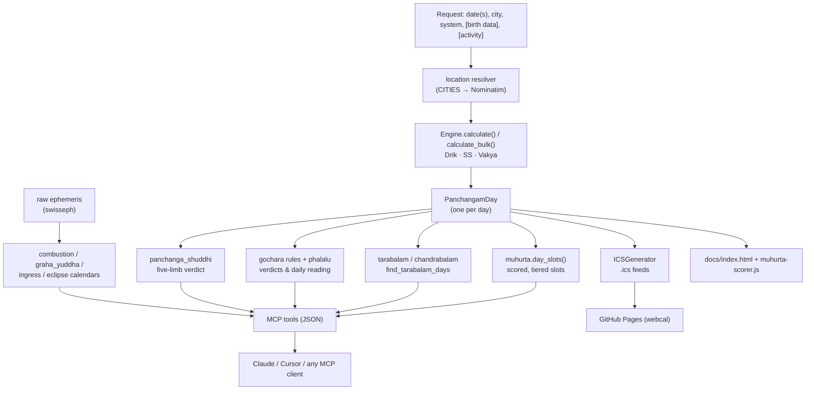
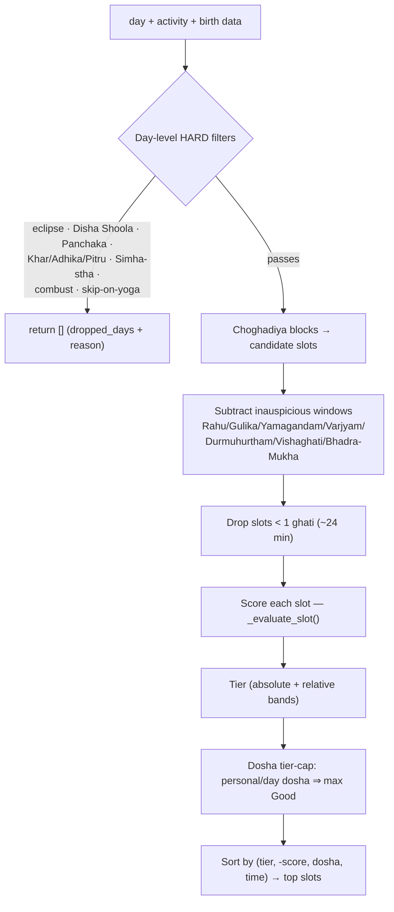

# 05 · Data Flow & the Muhurta Pipeline

How a request becomes an answer, end-to-end — then a deep look at the muhurta
scorer (`personal/muhurta.py`, ~1,200 lines), the most intricate consumer.

---

## End-to-end data flow

Two notes:
- The five **calendar** features (combustion, graha yuddha, ingress, eclipse) go
  largely straight to ephemeris, not through `PanchangamDay`.
- The landing page re-implements the scorer in JS to score in-browser; the
  Python↔JS parity is the motivation for the parked Phase 3 codegen step.

---

## The muhurta scorer in depth

**Goal:** given a day (or range), an activity, and optional birth data, return a
ranked list of auspicious time slots — each with a transparent reason list and a
tier (Excellent / Good / Fair / Avoid).

### Configuration: `ACTIVITY_RULES` (`muhurta.py:115–289`)

A declarative dict — **adding an activity is a data change, not code.** Each entry
can carry: `skip_on_yoga`, `skip_on_sankramana / khar_maasa / adhika /
pitru_paksha / simha_stha_guru / combust`, `prefer_choghadiya`,
`prefer_tithi_class`, `prefer_vara`, `prefer_lagna_class`, `prefer_bhadra_puchha`,
`prefer_nakshatra_mukha`, `penalty_on_simha_stha_shukra`. ~11 activities are
exposed via MCP (`any`, `travel`, `purchase`, `ceremony`, `beginning`,
`litigation`, `cremation`, `construction_roof`, `wood_cutting`, `well_digging`,
`coronation`).

### The pipeline

### What `_evaluate_slot()` adds up (`muhurta.py:794–1017`)

Per slot, starting from the Choghadiya base score (`Amrit 3 / Shubh 2 / Labh 2 /
Char 1`), in five reason groups:

- **slot_quality** — Choghadiya base; +2 for Abhijit-muhurta overlap; +2 per
  Amrita-kalam overlap.
- **day_quality** — special yogas (Sarvartha/Amrita +2, Dvi/Tripushkara +1,
  Visha/Dagdha −2, Vyatipata/Vaidhriti −2); tithi class (Rikta −2; preferred +1);
  Nitya-yoga disposition (hard-avoid −2, partial-avoid −1 within its dosha
  window, auspicious +1); Anandadi ±1; Simha-stha Shukra −2 (wedding).
- **group_fit** (per person, ±1 each) — **Tarabalam** (auspicious taras
  2/4/6/8/9 +1, unfav 1/3/5/7 −1); **Chandrabalam** (good 1/3/6/7/10/11 +1,
  avoid 4/8/12 −1, puja-remedial 2/5/9 flagged); **Lagna position** vs janma rasi
  (and janma lagna if given) — kendra/trikona +1, ashtama −1.
- **activity_match** — tithi-class match, vara match, **hora-ruler vara** match
  (+1), Bhadra-Puchha & Nakshatra-Mukha bonuses, activity-class lagna (Sthira for
  wedding, Chara for travel…), Choghadiya preference, **Panchaka Rahita**
  recomputed at the slot's rising lagna (Mrityu −3 universal, other doshas −2 if
  the activity matches `avoid_for`).
- **notes** — doctrinal caveats (e.g. "Siddhi rectifies tara but not chandra").

### Tiering & the dosha cap (`muhurta.py:39–100`)

Two band schemes: **absolute** (≥7 Excellent / ≥4 Good / ≥1 Fair / ≤0 Avoid) and
**relative** (75/50/25 percentiles of the found range). Crucially, a slot with an
unresolved **personal dosha** (`ashtama_chandra`, `chandra_avoid`,
`ashtama_lagna`, `chandra_remedial`, `tara_dosha`) or **day dosha** (`rikta_tithi`,
`amavasya`, `visha_dagdha_yoga`, `vyatipata_vaidhriti`) is **capped at Good** even
if it scored Excellent — classical doctrine: yogas don't fully rectify doshas.

### Slot-time precision

If an `engine` is passed, the scorer recomputes Moon-driven facts at each slot's
*start* via `engine.facts_at(slot_start)`, so a late-afternoon slot is judged
against the nakshatra/tithi/yoga active *then*, not at sunrise. Without an engine
it falls back to the day's sunrise snapshot.

### `diagnose_day()` (`muhurta.py:658–746`)

A lightweight pre-check that returns *why* a day was dropped (eclipse, Disha
Shoola, skip-yoga, Panchaka, Khar-Maasa…) — this populates `find_muhurta`'s
`dropped_days[]`.

---

## The supporting personal modules

| Module | Function | Output |
|---|---|---|
| `tarabalam.py` | `tara_number`, `is_auspicious_tara`, `good_for_all` | 9-tara strength from a birth star |
| `chandrabalam.py` | `chandra_position`, `chandra_verdict`, `rasi_from_nakshatra` | 12-position Moon-sign strength |
| `lagna_position.py` | `lagna_position`, `lagna_verdict`, `lagna_class_of` | kendra/trikona/ashtama + Chara/Sthira/Dvisvabhava class |
| `lagna_hora.py` | `get_horas`, `get_lagna_transitions` | 24 planetary hours; ascendant boundaries (swisseph, ±0.5 min) |
| `nitya_yoga.py` | `nitya_disposition` | hard-avoid / partial-avoid / auspicious / neutral |
| `tithi_class.py` | `tithi_family`, `is_rikta` | Nanda/Bhadra/Jaya/Rikta/Purna |
| `phalalu.py` | `rasi_phalalu` | deterministic daily reading (every line traced to a computation) |

> **Design throughline:** every score and every phalalu line is *deterministic and
> explainable* — no heuristic prose, no invented text. Per-person components are
> independent ±1 contributors, so you can add/remove people without re-tuning.
