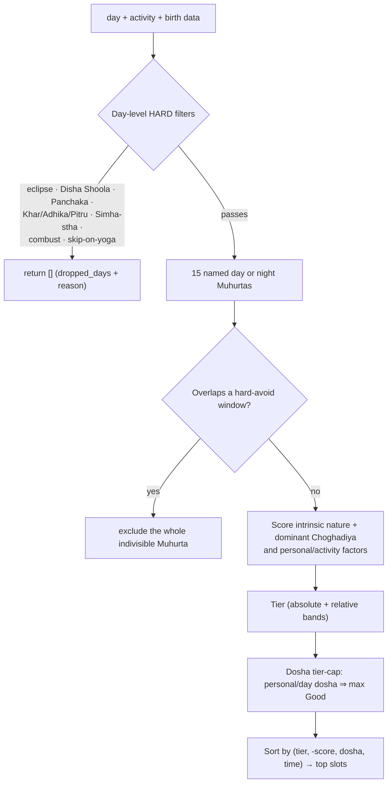

# 05 · Data Flow & the Muhurta Pipeline

How a request becomes an answer, end-to-end — then a deep look at the muhurta
scorer (split across three files in `personal/`), the most intricate consumer.

---

## End-to-end data flow

Two notes:
- The five **calendar** features (combustion, graha yuddha, ingress, eclipse) go
  largely straight to ephemeris, not through `PanchangamDay`.
- The landing page implements the scorer in TypeScript for in-browser use.
  Python owns the activity catalogue; a generated JSON contract and parity
  tests prevent the two surfaces from silently diverging.

---

## The muhurta scorer in depth

**Goal:** given a day (or range), an activity, and optional birth data, return a
ranked list of auspicious time slots — each with a transparent reason list and a
tier (Excellent / Good / Fair / Avoid).

### Three-file layout

| File | Role |
|---|---|
| `personal/activity_rules.py` | Declarative `ACTIVITY_RULES` dict — 30 activities, pure data. |
| `personal/activity_catalog.py` | Ordered browser-supported subset and selector groups. |
| `personal/slot_scorers.py` | Atomic scoring functions + `_DayContext` dataclass. |
| `personal/muhurta.py` | Orchestrator (~530 lines) — public API only. |

### Configuration: `ACTIVITY_RULES` (`activity_rules.py`)

A declarative dict — **adding an activity is primarily a data change**, plus a
catalogue/export update and source evidence. Entries carry hard gates,
preferences, exact admitted Tithis/Nakshatras/Lagnas, manual practitioner
checks, and (where verified) a stable provenance claim.
30 activities are supported by Python/MCP. The browser-supported subset is
declared in `activity_catalog.py`; `tools/export_activity_rules.py` generates
the exact rule fields consumed by TypeScript. `npm run activity:check` and the
Python contract tests fail if the committed export or static selector drifts.

### The pipeline

### What `_evaluate_slot()` adds up (`slot_scorers.py` + `muhurta.py`)

Per slot, the score combines named-Muhurta nature (`Abhijit`/`Brahma` +2,
other auspicious +1, inauspicious -2) with the dominant Choghadiya
(`Amrit` +3, `Shubh`/`Labh` +2, `Char` +1; others 0), in five reason groups:

- **slot_quality** — named Muhurta identity, deity and intrinsic nature;
  dominant Choghadiya (with boundary straddles disclosed); +2 for Amrita
  Kalam overlap.
- **day_quality** — special yogas (Sarvartha/Amrita +2, **Siddha Yoga +1**,
  Dvi/Tripushkara +1, Visha/Dagdha −2, Vyatipata/Vaidhriti −2);
  tithi class (Rikta −2 with classical neutralization; preferred +1);
  Nitya-yoga disposition (hard-avoid −2, partial-avoid −1 within its dosha
  window, auspicious +1); Anandadi ±1; Simha-stha Shukra −2 (wedding).
- **group_fit** (per person, ±1 each) — **Tarabalam** (auspicious taras
  2/4/6/8/9 +1, unfav 1/3/5/7 −1); **Chandrabalam** (good 1/3/6/7/10/11 +1,
  avoid 4/8/12 −1, puja-remedial 2/5/9 flagged); **Lagna position** vs janma rasi
  (and janma lagna if given) — kendra/trikona +1, ashtama −1.
- **activity_match** — tithi-class preferred +1; **tithi-class avoided −1**
  (e.g. Jaya for union ceremonies, Purna for legal contests); vara match;
  **hora-ruler vara** match (+1); Bhadra-Puchha & Nakshatra-Mukha bonuses;
  activity-class lagna (Sthira for wedding, Chara for travel…); Choghadiya
  preference; **Panchaka Rahita** recomputed at the slot's rising lagna
  (Mrityu −3 universal, other doshas −2 if the activity matches `avoid_for`).
- **notes** — doctrinal caveats (e.g. "Siddhi rectifies tara but not chandra").

#### Rikta neutralization (`score_tithi_class`)

When the day's tithi is Rikta (4/9/14), two classical conditions reduce
the −2 penalty:

| Condition | Effect | Source |
|---|---|---|
| Nakshatra = Pushya | Rikta cancelled (0) | Muhurta Chintamani |
| Sarvartha or Amrita Siddhi Yoga active | Partially offset (−1) | B.V. Raman Muhurtha |

Both conditions emit an explicit reason note. When both apply, Pushya
takes precedence (full cancellation).

### Tiering & the dosha cap (`muhurta.py`)

Two band schemes: **absolute** (≥7 Excellent / ≥4 Good / ≥1 Fair / ≤0 Avoid) and
**relative** (75/50/25 percentiles of the found range). Crucially, a slot with an
unresolved **personal dosha** (`ashtama_chandra`, `chandra_avoid`,
`ashtama_lagna`, `chandra_remedial`, `tara_dosha`) or **day dosha** (`rikta_tithi`,
`amavasya`, `visha_dagdha_yoga`, `vyatipata_vaidhriti`) is **capped at Good** even
if it scored Excellent — classical doctrine: yogas don't fully rectify doshas.

### Slot-time precision

If an `engine` is passed, the scorer recomputes Moon-driven facts at each slot's
*start* via `engine.facts_at(slot_start)`, so a late-afternoon slot is judged
against the nakshatra/tithi/yoga active *then*, not at sunrise. Without an engine
it falls back to the day's sunrise snapshot.

### `diagnose_day()` (`muhurta.py`)

A lightweight pre-check that returns *why* a day was dropped (eclipse, Disha
Shoola, skip-yoga, Panchaka, Khar-Maasa…) — this populates `find_muhurta`'s
`dropped_days[]`. Internally calls `_day_skip_reason()`, the same helper used
by `day_slots()` to keep day-skip logic in one place.

---

## The supporting personal modules

| Module | Function | Output |
|---|---|---|
| `activity_rules.py` | `ACTIVITY_RULES`, `ACTIVITIES` | Declarative per-activity config for all 30 activities |
| `activity_catalog.py` | `BROWSER_ACTIVITY_GROUPS`, `BROWSER_ACTIVITIES` | Explicit browser capability boundary and selector ordering |
| `slot_scorers.py` | `score_tithi_class`, `score_tara`, `score_chandra`, `score_lagna`, `score_special_yogas`, `score_nitya_yoga`, `anandadi_day_modifier`, `_DayContext` | All atomic scoring functions; `_DayContext` bundles day-constant params |
| `tarabalam.py` | `tara_number`, `is_auspicious_tara`, `good_for_all` | 9-tara strength from a birth star |
| `chandrabalam.py` | `chandra_position`, `chandra_verdict`, `rasi_from_nakshatra` | 12-position Moon-sign strength |
| `lagna_position.py` | `lagna_position`, `lagna_verdict`, `lagna_class_of` | kendra/trikona/ashtama + Chara/Sthira/Dvisvabhava class |
| `lagna_hora.py` | `get_horas`, `get_lagna_transitions` | 24 planetary hours; ascendant boundaries (swisseph, ±0.5 min) |
| `nitya_yoga.py` | `nitya_disposition` | hard-avoid / partial-avoid / auspicious / neutral |
| `tithi_class.py` | `tithi_family`, `is_rikta` | Nanda/Bhadra/Jaya/Rikta/Purna |
| `phalalu.py` | `rasi_phalalu` | deterministic daily reading (every line traced to a computation) |

> **Design throughline:** every score and every phalalu line is deterministic
> and explainable. Project ranking heuristics are labelled as heuristics;
> textual doctrine requires a ledger citation. Per-person components are
> independent contributors, so people can be added or removed without hidden
> model state.
