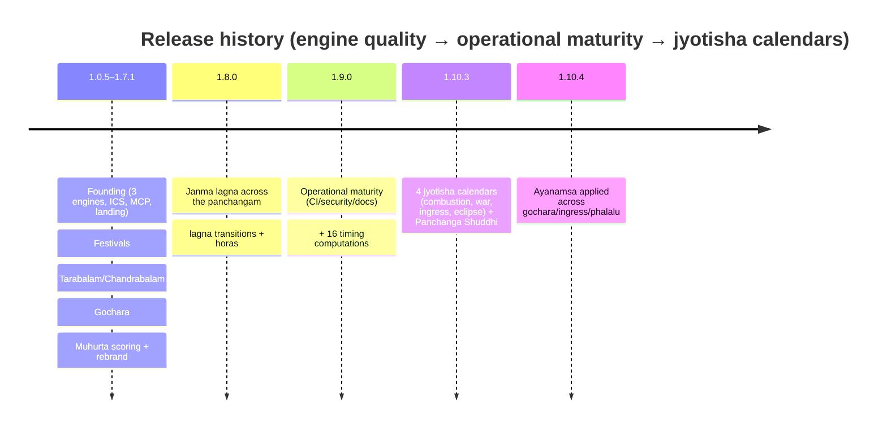

# 06 · Roadmap & Backlog

This page is architectural orientation and release history, not the active work
queue. Current maintenance status and priority live in the
[Telugu Calendar Utilities GitHub Project](https://github.com/users/socraticsurge/projects/2),
with acceptance criteria and discussion in
[repository Issues](https://github.com/socraticsurge/telugu-calendar-utilities/issues).

The historical phase tracker is
[`docs/tracking/improvement-plan.md`](../tracking/improvement-plan.md). This
page was reconciled **2026-08-27**; the phase tracker is retained for decision
history and should not be read as current execution state.

---

## Shipped

**Phases 1, 2, 6, 7 (shipped 2026-06-16)** — the "operational maturity" round
that landed inside the v1.9.0 tag:
- **P1** release-safety floor: version-sync test, publish gate, README/CoC fixes, CNAME guard, branch sweep.
- **P2** stabilizers: Dependabot, CI matrix 3.10–3.13, concurrency groups, branch protection (6 contexts), CodeQL + pip-audit, SHA-pinned Actions, lockfile, `ARCHITECTURE.md` + `MAINTENANCE_RUNBOOK.md`, SEO surface.
- **P6** (narrowed): forward-year DP-verified festival regression (2027–2028), table-driven festival rules. *Full `EngineCore` refactor parked.*
- **P7**: `find_muhurta` MCP signature fix, MCP tool tests, ICS golden snapshot, per-anga variant feeds, dead-code cleanup.

**Phase 9 (shipped as 1.10.x)** — transit computations + Panchanga Shuddhi:
all-planet Maudhya calendar, Graha Yuddha, planet ingress, eclipse calendar
tool, Panchanga Shuddhi. Then 1.10.4 wired ayanamsa through gochara/ingress/phalalu.

---

## Current maintenance posture

| Phase | Theme | State / resume |
|---|---|---|
| **Vite + TypeScript** | **Shipped.** Root `index.html`, `src/`, Vitest, TypeScript checks and the production Vite build are the active frontend. |
| **Accessibility / one-shell UI** | **Shipped baseline.** Contrast, dialogs/focus management, main landmark, skip link and local-time affordance are implemented; every visible change still needs browser evidence and owner sign-off. |
| **PWA / offline** | Optional future feature; no longer described as blocked on a missing Vite migration. |
| **Additive product work** | One feature at a time on the frozen core. The Muhurtam catalogue has 34 verified purpose-specific profiles, one explicit heuristic and one compatibility alias; specialist/sensitive candidates remain intentionally held in the activity backlog. |

---

## Parked indefinitely (each names its reactivation trigger)

| Item | Reactivation trigger |
|---|---|
| **`EngineCore` refactor** (unify 3 engines around one core) | a new engine variant is requested, OR a real bug traces to the duplication |
| `facts_at` signature enrichment | EngineCore reactivates |
| `SankrantiPolicy` + SS/Vakya `is_sankranti` convergence | a devotee reports an SS/Vakya `is_sankranti` flag wrong |
| Eclipse precision audit (vs USNO/NASA, decade) | an eclipse-timing discrepancy is reported |
| Public Python library API (`day_for(...)`) | a Python/notebook user asks |
| Ayanamsa selector in the **public UI** | a devotee asks for a non-Lahiri ayanamsa visibly |

**Killed:** REST API for per-request muhurta — staying on static GitHub Pages.

---

## Historical maintenance checkpoint

The detailed 2026-06-17 changelog, contributor-rewrite and documentation
checkpoint is retained in
[`docs/tracking/2026-06-17-maintenance-changelog-contributors-docs.md`](../tracking/2026-06-17-maintenance-changelog-contributors-docs.md).
Its temporary push instructions are historical, not current work.

---

## Governance: frozen-core stance — RESOLVED 2026-06-17

There is a **direct contradiction** between two docs about the "frozen core":

- **`CLAUDE.md`** (authoritative working agreement): *"Frozen core — do not
  modify without explicit owner approval … `telugu_panchangam/engines/` … The
  only routine change allowed here is appending a festival row."*
- **`ARCHITECTURE.md` lines 7–11** (status note, 2026-06-16): *"the engines were
  originally treated as 'frozen core' … That constraint has been **lifted**; the
  engines themselves are now editable, with the planned `EngineCore` unification
  scheduled for Phase 6."*

The improvement-plan resolves it in CLAUDE.md's favour: the Phase 6 *"`CLAUDE.md`
frozen-core text revision"* was **explicitly parked**, and the full EngineCore
refactor is parked too. So **CLAUDE.md (frozen core) is the governing rule
today**, and the ARCHITECTURE.md note is ahead of the actual decision.

**Resolution (owner decision, 2026-06-17): keep the engines frozen.**
`ARCHITECTURE.md`'s status note was corrected to say the constraint *remains*
in force (the `EngineCore` refactor is designed but parked), and `CLAUDE.md`
gained a matching note that the Phase 6 unification is parked, not active. The
two docs now agree: the frozen core stands until the owner explicitly lifts it,
and the only routine engine change is appending a DP-verified festival row.
