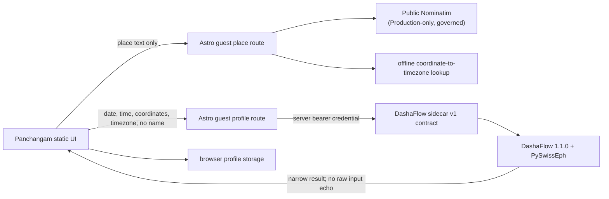

# Guest birth profiles and the D1 Rashi chart

This page explains the birth-details calculation used by guest Profiles. It is
for people checking what leaves the browser, how Nakshatra and the chart are
derived, and what “verified” does and does not mean.

> **Current assurance:** documented, traceable, and reproduced through a second
> formula path. The three fixture cells are not an independent published-chart
> comparison because both paths use Swiss Ephemeris. Public activation remains
> gated on the separate Swiss Ephemeris and PySwissEph wrapper decision,
> producer-contract invariants, governed Production geocoding/shared abuse
> controls, and the
> [production activation runbook](../operations/guest-calculation-production-activation.md).
> The exact Astro/DashaFlow backend pair has passed protected Preview contracts;
> the Panchangam journey still requires local owner review and one bounded,
> approval-gated Production smoke request because public Nominatim is disabled
> outside Production.

> **Activation state:** the birth-details interface and network adapter are on
> by default only for loopback development. A public build must set
> `VITE_BIRTH_PROFILE_API_ENABLED=true`, where `true` is the exact,
> case-sensitive value; every other explicit value fails closed. When inactive,
> Profiles defaults to manual entry and keeps existing calculated profiles
> viewable without permitting recalculation or editing.

## Meaning

A birth profile turns an exact local date, time, and selected birthplace into:

- Janma Nakshatra and Padam;
- Janma Rashi;
- Lagna and its degree within the Rashi;
- the sidereal Rashi and Whole Sign house of Surya, Chandra, Kuja, Budha, Guru,
  Shukra, Shani, mean Rahu, and Ketu; and
- a South Indian D1 Rashi chart.

The profile reuses Nakshatra and Padam in Muhurtam and Daily Horoscope. The D1
chart is a positional reference only. This contract does not return Dasha,
Yoga, compatibility, predictions, or interpretive claims from DashaFlow.

## Inputs and privacy boundary

| Input | Where it goes | Why |
|---|---|---|
| Profile name | Browser storage only | A local label for recognizing the person; it is rejected by the calculation gateway. |
| Place search text | Astro Chaganti gateway, then the geocoder | Returns at most five selectable places. Use a city or town, not a street address. |
| Selected latitude, longitude, and IANA timezone | Astro Chaganti gateway and DashaFlow sidecar | Resolves the birth instant and location-dependent ascendant. |
| Local date and exact local time | Astro Chaganti gateway and DashaFlow sidecar | Resolves the UTC instant used by the ephemeris. |
| Calculated result and original inputs | Origin-scoped browser `localStorage` | Reuses the profile without an account or repeated calculation. |

When the capability is active, the browser calls the server only after
**Find place** or **Calculate details**.
Application code does not create an Astro Chaganti account, database row, or
analytics event from these values. Network and hosting providers necessarily
process requests in transit; do not interpret “browser-local profile” as “no
network calculation.” The application does not load third-party executable
analytics code on this profile-bearing origin, and built-in share text omits
the saved profile name. There is no cloud sync or recovery.



The Astro gateway permits the Panchangam production origin and HTTP localhost
origins, caps bodies at 4 KiB, rate-limits requests, and marks responses
`private, no-store`. Its DashaFlow bearer token is server-only and must never be
placed in browser code or a `VITE_*` variable. The reviewed gateway stack uses
the existing Turso database for fail-closed shared client/fleet limits on all
guest routes. The public-Nominatim candidate also gives guest and signed-in
lookups one aggregate provider row, a 1,000-attempt UTC-day cap, and one
exclusive cross-instance send lease. Guest place search additionally applies a
durable allowance of 50 valid managed-provider cache misses per client in an
anchored 24-hour window, after its five-request-per-minute client guard. That
allowance is nominally 5% of the configured 1,000-attempt pool and prevents one
client identity from exhausting it, although an anchored-window reset can
permit up to 100 upstream attempts inside one UTC day. Place queries and
results are not written to that database; normalized results stay only in a
bounded server-process cache.
[#446](https://github.com/socraticsurge/telugu-calendar-utilities/issues/446)
must close and verify those controls before activation.

The build flag is not authorization and contains no secret. A public page uses
only the canonical `https://astrochaganti.com/api/guest` HTTPS gateway; a
loopback or arbitrary configured base is rejected. Consequently,
`VITE_BIRTH_PROFILE_API_BASE` cannot select a hosted Astro Preview today.
Astro also rejects a hosted Panchangam Preview origin. This is now a deliberate
isolation boundary: provider behavior is certified with fixtures, the exact
Astro/DashaFlow backend pair is certified in protected Preview, and the owner
reviews the complete Panchangam browser journey locally before one bounded
Production smoke request. Public activation requires
both the exact client flag and independently enabled server-side routes. The
server must remain disabled until the licensing and provider gates below are
resolved. A disabled browser adapter throws a typed `disabled` error before it
creates a timeout or calls `fetch`.

## Local storage transaction

Calculated profiles use a three-key browser transaction: the legacy-compatible
base profile array, a revision-bound birth-data envelope, and a commit marker.
The marker is written last and records both the revision and the exact base
payload. A reader attaches birth data only when all three values agree; base or
envelope events observed before the marker therefore load fail-closed without
attaching a mismatched chart.

If any write fails, the store does not automatically delete or roll back keys:
multi-key `localStorage` has no atomic fence that could prevent such cleanup
from overwriting a newer tab. Existing companion bytes remain untouched until
their own write step; an absent or mismatching marker keeps every partial new
base or envelope detached.

When the base key is absent, confirmed recovery is offered only when every
present companion exactly matches the store's current recognized format; when
both companions are present, their revision and base relationships must also
agree. This is conservative format recognition, not proof of which code wrote
the bytes. Unrecognized or future-format bytes remain read-only. A base-present
torn transaction can be replaced only by an explicit user reset or later
successful save. The failure points, cross-tab boundary, and orphan rules are
pinned in
[`src/__tests__/guest-profile-store.test.ts`](https://github.com/socraticsurge/telugu-calendar-utilities/blob/master/src/__tests__/guest-profile-store.test.ts).

## Calculation process

### Response and saved-record validation

The browser accepts contract version `1.0`, engine name `DashaFlow`, a
non-empty engine version, and `Lahiri` ayanamsha. It requires the canonical
Rashi and Nakshatra spellings and exactly this ordered nine-graha tuple:

```text
Surya, Chandra, Kuja, Budha, Guru, Shukra, Shani, Rahu, Ketu
```

The fields are also checked against each other rather than trusted as
independent labels. The reported Nakshatra and Padam must derive the reported
Janma Rashi, and Chandra's Rashi must equal that Janma Rashi. Because the
service projects Chandra's degree within its Rashi to two decimals, the browser
treats that displayed degree as a closed ±0.005° interval, clipped to the
Rashi. The reported Nakshatra-Padam cell is accepted only when at least one
longitude in that interval belongs to the cell. This admits an honestly rounded
boundary value without allowing an incompatible Moon position.

Each graha's reported house must also equal the Whole Sign house derived from
the reported Lagna and graha Rashi. Surya and Chandra must be direct; Rahu and
Ketu must be retrograde; and the rounded Rahu/Ketu positions must remain
opposite within the maximum 0.01° separation error introduced by rounding both
ends to two decimals.

The same canonical metadata, graha order, and cross-field relationships are
checked before a calculated extension read from `localStorage` is attached to
its base profile. Malformed, reordered, future-contract, or internally
inconsistent calculated data fails closed to the manual-profile view; it is
not silently presented as a verified D1 result.

### 1. Resolve the birth instant

The exact `YYYY-MM-DD` date and `HH:MM` time are interpreted as local civil time
in the selected IANA timezone. DashaFlow converts that value to UTC and then to
a Universal-Time Julian day:

```text
local civil date/time + IANA timezone
  -> timezone-aware local instant
  -> UTC instant
  -> Julian day UT
```

The IANA identifier matters because a numeric offset alone cannot represent
historical daylight-saving and government rule changes.

Before sending a calculation request, the browser resolves that same wall time
in the selected birthplace timezone. Its latest selectable date is the current
civil date there, not the computer's UTC or local date. A future instant, an
invalid timezone, or an ambiguous or nonexistent daylight-saving wall time is
rejected in the form instead of being silently assigned an offset.

### 2. Select the astronomical convention

DashaFlow explicitly selects Lahiri sidereal mode and uses:

```text
FLG_SIDEREAL | FLG_SPEED
```

for the graha positions. The positions are geocentric; this contract does not
set the topocentric flag. Swiss Ephemeris documentation requires the sidereal
flag and an explicit sidereal mode for a chosen ayanamsha.

The returned `engine.ephemeris` is read from the actual Swiss Ephemeris return
flags. It is `swiss`, `moshier`, or `unknown`. It is never inferred from the
requested flags or package name. Swiss Ephemeris can fall back to Moshier when
the requested data files are not present, which is why this disclosure is part
of every saved profile.

Technical reference: [Swiss Ephemeris Programmer's Documentation](https://www.astro.com/swisseph/swephprg.htm),
sections 3, 12, and 15.4.

### 3. Derive Nakshatra, Padam, and Janma Rashi

Let `M` be the normalized sidereal Moon longitude in `[0°, 360°)`.

```text
nakshatra_span = 360° / 27
pada_span       = 360° / 108

nakshatra_index = floor(M / nakshatra_span)
degree_in_star  = M - nakshatra_index * nakshatra_span
pada            = floor(degree_in_star / pada_span) + 1
janma_rashi     = floor(M / 30°)
```

Indices select the canonical 27-Nakshatra and 12-Rashi name tables. The sidecar
normalizes DashaFlow spellings such as `Ashwini` and `Dhanishta` to the existing
Panchangam vocabulary `Ashvini` and `Dhanishtha`.

### 4. Derive Lagna and Whole Sign houses

The ascendant is the first value in `ascmc` returned by:

```text
houses_ex(julian_day_ut, latitude, longitude, "W", sidereal_flags)
```

`W` is the Whole Sign house method. If `L` is the Lagna Rashi index and `P` is a
graha's Rashi index, the house number is:

```text
house = ((P - L) mod 12) + 1
```

The [Swiss house-function reference](https://www.astro.com/swisseph/swephprg.htm)
supports the UT, coordinate, sidereal-flag, and house-method API semantics. It
does not by itself establish a textual Jyotisha authority for choosing Lahiri
or Whole Sign houses; those are explicit product conventions.

### 5. Derive the nine displayed grahas

`calc_ut` supplies Surya, Chandra, Kuja, Budha, Guru, Shukra, Shani, and mean
Rahu. Ketu is placed exactly 180° from Rahu:

```text
ketu_longitude = (rahu_longitude + 180°) mod 360°
```

Surya and Chandra are always represented as direct. Rahu and Ketu are always
represented as retrograde. The other grahas are retrograde when their returned
longitudinal speed is negative. Degrees within a Rashi are rounded to two
decimal places for this contract.

## Reproduction fixture

The repository pins three synthetic cells across India, North America, and
Europe in [`tests/fixtures/birth_profile_reference.json`](../../tests/fixtures/birth_profile_reference.json).
For example:

| Input | Reproduced result |
|---|---|
| 1990-04-15 14:30, Hyderabad, `Asia/Kolkata` | Jyeshtha, Padam 4; Vrischika Janma Rashi; Simha Lagna 4.69°; Moshier |

`tests/test_birth_profile_reference.py` recomputes the narrow contract directly
with PySwissEph without importing DashaFlow. That protects the time conversion,
longitude partitions, Ketu rule, Whole Sign house rule, canonical names, and
two-decimal projection against drift.

Run:

```bash
.venv/bin/python -m pytest tests/test_birth_profile_reference.py -q
npm test
```

This is **reproduction checked**, not independently source-compared. A future
comparison must name the external chart, its exact input cell, ayanamsha, node,
house, ephemeris, and timezone conventions rather than comparing labels alone.

## Known limitations and release gates

1. **Swiss Ephemeris and PySwissEph licensing:** On 2026-09-04 the owner chose
   the AGPL-compatible public-source path for this calculation stack. The
   current TCU/MCP release is AGPL-3.0-or-later, retains the PySwissEph and
   Swiss Ephemeris notices, and offers corresponding source from the public
   repository. DashaFlow and Astro must publish their exact deployed source
   revisions under the same compatible posture before their public calculation
   flags are enabled. This implements the conservative whole-project boundary
   stated by [Astrodienst's licensing page](https://www.astro.com/swisseph/swisseph.htm)
   and the network-source opportunity described by
   [GNU AGPL section 13](https://www.gnu.org/licenses/agpl-3.0.html#section13).
   The decision, existing-distribution audit, implementation, and wrapper path
   remain recorded in
   [#231](https://github.com/socraticsurge/telugu-calendar-utilities/issues/231)
   with required children
   [#444](https://github.com/socraticsurge/telugu-calendar-utilities/issues/444),
   [#445](https://github.com/socraticsurge/telugu-calendar-utilities/issues/445),
   and [#449](https://github.com/socraticsurge/telugu-calendar-utilities/issues/449).
2. **Actual ephemeris:** current local fixture calls report Moshier because the
   deployed data-file posture has not been approved. Production must probe and
   disclose its own actual return flags; it must not promise Swiss data-file
   output merely because PySwissEph is installed.
3. **DST ambiguity:** DashaFlow 1.1.0 itself calls `pytz.localize` without the
   fail-closed `is_dst=None` option. The authenticated sidecar contract therefore
   validates the complete local civil time first and rejects repeated or skipped
   wall times instead of letting the library choose a side. Guests with one of
   these unusual recorded times must use manual profile entry until an explicit
   first/second-occurrence choice is supported. The
   [pytz documentation](https://pythonhosted.org/pytz/) describes this boundary.
4. **Historical timezones:** the IANA database itself warns that many pre-1970
   records represent only part of a region and are not authoritative everywhere.
   See [IANA timezone theory and limitations](https://www.iana.org/time-zones/theory).
5. **Place search policy and cache:** this UI uses an explicit submit action,
   asks for city/town only, and warns against street addresses. Astro
   [PR #169](https://github.com/socraticsurge/astro-unified-core/pull/169)
   retains the existing public Nominatim service through a fixed,
   Production-only `nominatim-public` adapter. It sends an identifying
   application User-Agent, rejects redirects and oversized or malformed
   responses, and returns at most five normalized rows. Public Nominatim is
   disabled in real local development and Preview; those environments use
   fixtures and cannot compete with Production. Every Production cache miss
   uses the existing Turso database for one guest-and-authenticated provider
   pool, a code-capped 1,000-attempt UTC-day budget, a 12,500 ms exclusive
   crash-recovery lease, and an exact-fence completion update. Normal
   completion establishes a 1,100 ms cooldown. If public Nominatim returns
   `429`, its bounded numeric or HTTP-date `Retry-After` is instead persisted
   fleet-wide through that same fenced update, up to 24 hours. A missing,
   malformed, past, or zero-delay value uses 60 seconds and cannot shorten the
   shared backoff.
   Guest place search first applies its five-request-per-minute client guard,
   then, after request validation, process-cache lookup, and duplicate
   coalescing, a durable allowance of 50 valid managed-provider cache misses per
   client and anchored 24-hour window. This second guard has its own bounded
   two-second storage deadline. Malformed requests and reusable results do not
   spend this durable allowance, though malformed requests may already spend
   the earlier route capacity, fleet, and minute guards. Fifty is nominally 5%
   of the configured 1,000-attempt pool and prevents one client identity from
   exhausting it. Because this client window is anchored rather than
   UTC-aligned, a reset can permit up to 100 upstream attempts inside one
   provider UTC day.
   Hashed cache keys and normalized result rows remain only in a bounded
   24-hour server-process cache—not Turso or Redis. The browser validates an
   allowlist of structured provider/OpenStreetMap attribution links and renders
   them beside results. Provider transit includes only the deliberately
   submitted city/town query, not a profile name or birth date/time. The
   [Nominatim usage policy](https://operations.osmfoundation.org/policies/nominatim/)
   is part of the release contract. Implementation certification is tracked in
   [#233](https://github.com/socraticsurge/telugu-calendar-utilities/issues/233)
   and [#446](https://github.com/socraticsurge/telugu-calendar-utilities/issues/446).
   Existing Production signed-in profile creation/editing keeps its disclosed
   legacy Nominatim path while `AUTH_PROFILE_MANAGED_GEOCODER_ENABLED` is absent
   or false; Preview remains fixture-only. Exact `true` migrates Production to
   the same governed adapter, adds a ten-call-per-user limit, and shares the
   30-call fleet and provider-lease boundaries with guest search without
   depending on guest feature flags. Guest public-Nominatim configuration
   itself fails closed until this migration is also enabled. No LocationIQ,
   Geoapify, Upstash, or Redis account is required. Regression evidence remains
   under
   [#447](https://github.com/socraticsurge/telugu-calendar-utilities/issues/447).
6. **Birth-time sensitivity:** a small time difference can change Lagna near a
   boundary. The current calculated path accepts exact recorded time only. An
   unknown or approximate time must use manual entry; no precise Lagna is
   fabricated.
7. **Storage scope:** browser data is visible to anyone using the same browser
   profile and origin. Clearing site data, changing domain/port, or using another
   device loses access. There is no recovery.

## Implementation ownership and review triggers

| Layer | Owner | Tests |
|---|---|---|
| Browser API validation | `src/lib/birth-profile-api.ts` | `src/__tests__/birth-profile-api.test.ts` |
| Public/local activation policy | `src/lib/remote-calculation-activation.ts` | `src/__tests__/remote-calculation-activation.test.ts` |
| Commit-bound fail-closed local storage | `src/lib/guest-profile-store.ts` | `src/__tests__/guest-profile-store.test.ts` |
| Profile form, review, and D1 chart | `src/panels/profiles.ts` | `src/__tests__/profiles-panel.test.ts`, browser smoke tests |
| Public stateless gateway | `astro-unified-core` guest API routes | route, CORS, rate-limit, body-cap, and contract tests in that repository |
| Authenticated calculation projection | `dashaflow-sidecar/api/profile.py` | sidecar profile-contract tests |

Review this page when any contract version, DashaFlow/PySwissEph version,
ayanamsha, node choice, house method, timezone package/data, place provider,
rounding rule, storage schema, actual ephemeris, or privacy boundary changes.
