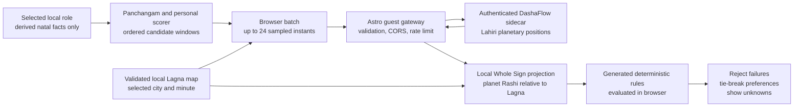

# Muhurtam election-chart screening

This page defines the source-backed chart screen that follows the browser's
existing Panchangam and personal Muhurtam ranking. It answers four separate
questions without collapsing them into one opaque score:

1. Which candidate windows survive the existing day, slot and personal gates?
2. Which source statements can be expressed as deterministic Whole Sign house
   predicates?
3. Which candidate windows fail those predicates in any sampled Lagna-stable
   state?
4. Which source statements still require a practitioner because the text does
   not define a complete computational model?

> **Assurance boundary:** a chart-screened result has passed the automated
> predicates listed below at the start, final represented minute, each
> 10-minute cadence point, and both sides of every known local Drik/Lahiri
> Lagna transition inside the offered window. The browser recomputes Whole
> Sign houses from the sidecar's planetary Rashis in that local Lagna frame.
> A window that only partly overlaps the five-minute transition guard at an
> edge is retained for review, never hard-rejected or promoted by a
> Lagna-dependent rule. It is
> not a complete election, a continuous-time proof, a
> compatibility reading, or a professional recommendation. A high relative
> tier still means “best among the candidates evaluated,” not universally
> auspicious.

## Architecture and data minimization

The browser already has the selected city and locally stored, derived profile
facts. Personal rules run in the browser. The remote chart request deliberately
contains neither a person nor an activity; the returned candidate-time charts
are evaluated against the generated rule table locally.



### Activation and release boundary

The browser implementation and deterministic rules can be reviewed without
activating a public network capability. Public builds fail closed unless
`VITE_ELECTION_CHART_API_ENABLED` is the exact, case-sensitive string `true`.
Whitespace, alternate casing, empty strings and other values disable the
capability. With no flag, requests are enabled only on `localhost`,
`127.0.0.1`, or `[::1]` for local development. This flag is independent from
`VITE_BIRTH_PROFILE_API_ENABLED`; enabling one calculation journey does not
enable the other.

The current public build does not set that flag, and the production Astro
deployment does not yet contain the guest election route. Activation remains
blocked by #443, #445, #446, #447, and #449, followed by the exact pair-bound
Preview certification in #448. That hosted Preview cannot run with the current
client allowlists, CORS policy, and protected service-to-service deployments.
See the
[production activation runbook](../operations/guest-calculation-production-activation.md).

When disabled, the browser does not create a request controller, register a
timeout or call `fetch`. It retains the Panchangam shortlist, caps any
`Excellent` label at `Good`, marks the result for review, and states that exact
chart screening is not active in that build. Public requests, when explicitly
enabled, can use only the canonical
`https://astrochaganti.com/api/guest` HTTPS base. Loopback, arbitrary-host,
credential-bearing, query, fragment, port and path overrides are rejected.
`VITE_ELECTION_CHART_API_BASE` therefore cannot point a deployed client at an
Astro Preview today.
The browser flag is not server authorization; the gateway and sidecar must be
activated independently under their own release approval.

When explicitly active, the public browser calls
`POST /api/guest/muhurta/election-charts`. The gateway
forwards a narrow authenticated request to the sidecar's
`POST /v1/election-chart/derive` contract. Both layers are stateless for this
operation and responses use no-store caching directives.

| Data category | Network treatment |
|---|---|
| Contract version | Sent so an incompatible response fails closed. |
| Candidate city | Latitude, longitude and IANA timezone are sent because Lagna is location-dependent. The free-form place label is not sent. |
| Candidate times | Up to 24 unique minute-precision RFC 3339 UTC instants are sent in request order. |
| Activity | Not sent. Rule selection occurs in the browser. |
| Profile identity | Name, profile ID and selected role are not sent; the gateway rejects these fields. |
| Birth data | Date, time, birthplace, Nakshatra, Janma Rashi, Janma Lagna and natal chart are not sent; the gateway rejects birth and natal fields. |
| Response | Contract/engine metadata including the required `mean` node convention, echoed location, and one sidecar Lagna plus nine-graha snapshot per instant. Planetary Rashis and degrees are retained; browser decisions recompute houses against the validated local Lagna map. |
| Browser storage | Candidate-time charts are never written to `localStorage`. The selected role is a versioned, bounded activity-to-stable-profile-ID preference stored only in this browser; it is reconciled after profile edit/deletion and is never sent, included in shared text, or exported. |

The request uses `credentials: omit` and `cache: no-store`. The public gateway
also enforces a 4 KiB body cap, strict origin policy, rate limiting and exact
response validation. Network and hosting providers still process the narrow
request in transit; “data-minimized” does not mean “no network calculation.”
The reviewed gateway candidate makes the election-chart route combine its
process-local guard with an atomic Upstash Redis limit shared across Vercel
instances and fail closed if that layer is missing or unavailable. A later
local remediation candidate expands shared limits to all three guest routes.
Neither statement is evidence that the code is merged, configured, deployed,
or operationally certified, and Upstash limiting is not a shared geocoder
cache.

## Astronomical contract

The chart service returns:

- DashaFlow engine name and version;
- the actual ephemeris state reported by the calculation (`swiss`, `moshier`,
  `mixed`, or `unknown`);
- `Lahiri` ayanamsha;
- the contract-bound `mean` lunar-node convention;
- sidecar Whole Sign houses and Lagna, retained for contract diagnostics but
  not used as the browser's house authority; and
- exactly the ordered tuple `Surya`, `Chandra`, `Kuja`, `Budha`, `Guru`,
  `Shukra`, `Shani`, `Rahu`, `Ketu`; the separate node convention makes Rahu
  the mean node.

`mixed` means the screening run did not use one uniform ephemeris state across
every snapshot or accepted service batch; it must be disclosed rather than
simplified to `swiss` or `moshier`.
The same derivation and licensing caveats as the guest D1 chart apply; see
[Guest birth profiles and the D1 Rashi chart](53-birth-profile-calculation.md).
For a vacancy predicate, **all nine returned grahas count as occupants**,
including Rahu and Ketu. The network adapter accepts only one complete set of
those nine canonical names with canonical Rashis and integer houses 1–12. It
also checks response order, exact input instants, echoed location, DashaFlow,
Lahiri, mean-node and Whole Sign metadata. One missing, duplicated, reordered or
unrecognized value rejects the entire batch as an invalid response. Planet and
Lagna degrees must match the sidecar's two-decimal projection (including its
representable value immediately below a rounded 30° boundary); each returned
house must agree with the returned Whole Sign Lagna; Surya and Chandra must be
direct; and retrograde Rahu/Ketu must remain opposite within the combined
0.01° rounding envelope. A contradiction fails the batch closed. Before a
predicate runs, the browser resolves the local Lagna Rashi for the exact sample
minute and recomputes every graha's Whole Sign house as:

```text
H(p) = ((RashiIndex(p) - LocalLagnaIndex + 12) mod 12) + 1
```

The sidecar's returned `planet.house` and Lagna Rashi cannot override this
frame. A missing or invalid minute-to-Lagna mapping rejects the affected
service batch before it can contribute outcomes. If no earlier batch completed,
the UI falls back to the unscreened shortlist with state `unavailable`; after
one or more batches completed, the partial-run rules below apply. It never uses
the valid-looking part of a malformed batch.

Engine provenance is also a run-wide invariant. Name, version, ayanamsha and
node convention must remain identical across accepted batches; an incompatible
later batch is rejected before any of its windows are applied. Ephemeris is the
only aggregating field: differing accepted ephemeris disclosures are preserved
as `mixed`.

The pure Python and TypeScript predicate evaluators separately fail closed to
`unknown` if a caller invokes them directly with an incomplete chart. That is
a unit-level defensive state, not the public network behavior described above.

### Drik/Lahiri-only boundary

The sidecar contract is a Lahiri sidereal, Whole Sign, DashaFlow calculation.
It is therefore used only when the website's selected system is `drik`. A
Surya Siddhanta or Vakya search keeps its independently ranked shortlist and is
labelled `unsupported-system`; the application does not silently mix a
Drik/Lahiri chart into another system.

This boundary is about compatible conventions, not implementation identity.
The DashaFlow sidecar is not asserted to be the same implementation as the
repository's frozen Drik engine. The returned engine and actual ephemeris
metadata must remain visible for verification.

### Independent calculation verification

The positional contract was checked on 2026-08-29 against dated Drik Panchang
sidereal-position pages, not only against repository fixtures. Those pages
state that the displayed clock is local and DST-adjusted, the zodiac is
sidereal, Lahiri/Chitrapaksha is the default ayanamsha, and the displayed Rahu
and Ketu are mean positions unless changed to the separately listed true-node
values. The comparison used the exact minute shown in each dated URL and the
page's GeoNames location.

| Reference | Drik Panchang | DashaFlow projection | Result |
|---|---|---|---|
| Hyderabad, 2026-08-27 13:48 IST | [Vrischika Lagna 27°32′; nine grahas](https://www.drikpanchang.com/planet/position/planetary-positions-sidereal.html?geoname-id=1269843&date=27%2F08%2F2026&time=13%3A48%3A00) | Vrischika 27.36°; every graha in the same Rashi | Pass |
| Hyderabad, 2026-08-28 03:39 IST | [Karka Lagna 7°05′; nine grahas](https://www.drikpanchang.com/planet/position/planetary-positions-sidereal.html?geoname-id=1269843&date=28%2F08%2F2026&time=03%3A39%3A00) | Karka 6.91°; every graha in the same Rashi | Pass |
| Washington, D.C., 2026-07-14 03:30 EDT | [Vrishabha Lagna 24°10′; nine grahas](https://www.drikpanchang.com/planet/position/planetary-positions-sidereal.html?geoname-id=4140963&date=14%2F07%2F2026&time=03%3A30%3A00) | Vrishabha 24.39°; every graha in the same Rashi | Pass |
| Hyderabad, 2026-01-15 10:19 IST | [Meena Lagna 0°11′](https://www.drikpanchang.com/planet/position/planetary-positions-sidereal.html?geoname-id=1269843&date=15%2F01%2F2026&time=10%3A19%3A00&lang=en) | Kumbha 29.98°; planetary Rashis still agree | Known Lagna-boundary divergence; local frame and review guard apply |
| Sydney, 2026-05-28 14:35 AEST | [Tula Lagna 0°03′](https://www.drikpanchang.com/planet/position/planetary-positions-sidereal.html?geoname-id=2147714&date=28%2F05%2F2026&time=14%3A35%3A00&lang=en) | Kanya 29.48° and remains Kanya at 14:36 | Known Lagna-boundary divergence; local frame and review guard apply |

All 27 interior planet comparisons agreed on Rashi. Degree-within-Rashi differences
were at most 0.01° for planets after the sidecar's two-decimal projection and
0.23° for Lagna; the locked regression permits 0.03° and 0.30° respectively.
Those interior cases verify the planetary sign inputs used by the implemented
predicates; they do not establish exact Lagna-boundary identity. The two
boundary captures demonstrate why the local Lagna projection and review guard
are part of the public computation contract. None of these comparisons is a
claim of sub-arc-minute identity.
The sidecar stores the captured external values, exact URLs, conventions and
coordinates in `tests/fixtures/election_chart_drikpanchang_capture.json` and
recomputes all three interior cases in its contract suite without making a live
network request. The two known boundary differences are locked separately as
negative-equivalence fixtures: a future interior match cannot be reported as
proof that the two Lagna conventions are identical at transitions.

### Boundary-guard audit

The five-minute guard is also backed by a reproducible local sweep, not chosen
from the two named examples alone. The committed audit compares the generated
`lagna.json` minute boundary with the same PySwissEph sidereal-Lahiri Whole Sign
Ascendant primitive and flags used by DashaFlow 1.1.0. Its fixed product
envelope is all 22 supported cities on the 15th of every month from January
2025 through December 2032:

| Audit result | Measured value |
|---|---:|
| City-dates | 2,112 |
| Distinct first-cycle Lagna transitions | 25,344 |
| DashaFlow first carried the published new Lagna at `T` / `T+1` / `T+2` | 3,334 / 18,865 / 3,145 |
| Later than `T+2` | 0 |
| Maximum continuous boundary delta | 1.61088 minutes |
| Remaining margin inside the ±5-minute guard | 3.38912 minutes |
| Minimum dwell between audited adjacent transitions | 51 minutes |

The maximum occurred at Tirupati on 2028-05-15 for the published 16:15 Tula
transition. The minimum dwell occurred at London on 2025-01-15. The machine-
readable report is
`tests/fixtures/lagna-boundary-guard-audit.json`; the default Python suite
recomputes and compares the whole report, so `tools/verify_project.py` cannot
pass with a stale boundary claim. The standalone equivalent is:

```bash
.venv/bin/python tools/audit_lagna_boundary_guard.py \
  --verify tests/fixtures/lagna-boundary-guard-audit.json
```

Some generated days currently expose a second-cycle tail beyond the first 12
advances. This audit deliberately measures one complete zodiac cycle—exactly
12 distinct boundaries per city-date—so the guard evidence is not inflated by
duplicates and does not certify that separate artifact-shape behavior.

## Exact automated-rule matrix

The canonical table is
`telugu_panchangam.personal.election_chart_rules.ELECTION_CHART_RULES`.
`tools/export_election_chart_rules.py` projects it to the browser; the generated
JSON is not an independent authority. There are 23 deterministic predicates
across 12 activity profiles.

`Reject` means a failed predicate removes the window. `Prefer` means a passing
predicate is tie-break evidence only; it adds no raw score and its absence does
not reject the window.

Every generated predicate carries both its `source_claim` and a
claim-specific `source_locator` (chapter/section plus printed and PDF page, or
verse plus printed page). The UI displays that locator with the computed
outcome; a generic book title is never substituted for the exact rule
location.

The same Python module owns `ELECTION_CHART_MANUAL_REMAINDERS`. For each
screened activity it contains only the qualitative clauses left after the
predicates below; this prevents the result card from asking a practitioner to
re-check the exact condition it just computed. Non-Drik, unavailable and
Python/MCP results retain their original full `manual_checks` disclosure.

Let `H(p)` be the locally recomputed Whole Sign house of graha `p` using the
validated selected-city Lagna frame, `G` the complete nine-graha set, and `S`
a listed set of houses. The four supported predicate
kinds are exactly:

```text
house_empty(h)                = every p in G has H(p) != h
planet_not_house(p, h)        = H(p) != h
planet_in_houses(p, S)        = H(p) is in S
any_planet_in_houses(P, S)    = at least one p in P has H(p) in S
```

There is no implicit aspect, orb, dignity, natural/functional-benefic or
house-lord calculation behind these predicates.

| Activity | Rule ID | Deterministic predicate | Effect | Source claim |
|---|---|---|---|---|
| Wedding | `wedding.house-7-vacant` | None of the nine grahas occupies house 7 | Reject | `muhurta.wedding` |
| Wedding | `wedding.kuja-not-8` | Kuja is not in house 8 | Reject | `muhurta.wedding` |
| Wedding | `wedding.shukra-not-6` | Shukra is not in house 6 | Reject | `muhurta.wedding` |
| Annaprasana | `annaprasana.house-10-vacant` | House 10 is vacant | Reject | `muhurta.annaprasana` |
| Annaprasana | `annaprasana.budha-not-7` | Budha is not in house 7 | Reject | `muhurta.annaprasana` |
| Annaprasana | `annaprasana.kuja-not-8` | Kuja is not in house 8 | Reject | `muhurta.annaprasana` |
| Annaprasana | `annaprasana.shukra-not-9` | Shukra is not in house 9 | Reject | `muhurta.annaprasana` |
| Seemantha | `seemantha.house-8-vacant` | House 8 is vacant | Reject | `muhurta.seemantha` |
| Seemantha | `seemantha.chandra-not-8` | Chandra is not in house 8 | Reject | `muhurta.seemantha` |
| Gruhapravesha | `gruhapravesha.house-8-vacant` | House 8 is vacant | Reject | `muhurta.gruhapravesha` |
| Land purchase | `property.guru-kendra-trikona` | Guru is in 1, 4, 5, 7, 9 or 10 | Prefer | `muhurta.land_purchase.building` |
| Land purchase | `property.kuja-11` | Kuja is in house 11 | Prefer | `muhurta.land_purchase.building` |
| Land purchase | `property.kuja-not-lagna` | Kuja is not in house 1 | Reject | `muhurta.land_purchase.building` |
| Completed-house purchase | `house-purchase.kuja-not-lagna` | Kuja is not in house 1 | Reject | `muhurta.house_purchase.completed` |
| General purchase | `purchase.chandra-lagna` | Chandra is in house 1 | Prefer | `muhurta.purchase.general` |
| General purchase | `purchase.shukra-lagna` | Shukra is in house 1 | Prefer | `muhurta.purchase.general` |
| Entering service | `job.surya-or-kuja-10-11` | Surya or Kuja is in house 10 or 11 | Prefer | `muhurta.service_entry` |
| Shantika / Paushtika | `ceremony.surya-10` | Surya is in house 10 | Prefer | `muhurta.shantika_paushtika` |
| Shantika / Paushtika | `ceremony.chandra-4` | Chandra is in house 4 | Prefer | `muhurta.shantika_paushtika` |
| Shantika / Paushtika | `ceremony.guru-lagna` | Guru is in house 1 | Prefer | `muhurta.shantika_paushtika` |
| Pilgrimage | `pilgrimage.guru-lagna-or-9` | Guru is in house 1 or 9 | Prefer | `muhurta.pilgrimage` |
| Travel | `travel.kuja-not-8` | Kuja is not in house 8 | Reject | `muhurta.travel` |
| Surgery | `surgery.house-8-vacant` | House 8 is vacant | Reject | `muhurta.surgery` |

No deterministic chart rule is invented for Gold / jewelry purchase. Its
source instruction depends on qualitative benefic aspect judgment, but the
inspected passage does not define the aspect model, benefic model, strength
threshold or conflict resolution needed for reproducible automation. Gold
therefore remains `manual-only`, and selecting it causes no chart API call.

## Activity-specific personal roles

The generic group scoring treats every selected person as an independent Tara,
Chandra and Lagna contributor. Four source passages instead name a governing
person. The UI therefore asks for one primary role and, for Drik, evaluates the
following source rule from the returned Chandra facts and canonical local
Lagna at every
sampled state in the same enrichment pass as the general chart predicates:

For an ordered cycle of length `N`, the inclusive position used by Travel and
Seemantha is:

```text
position = ((candidate_index - natal_index + N) mod N) + 1
```

`N = 12` for Rasi/Lagna and `N = 27` for Nakshatra. Position 1 therefore means
the candidate and natal value are the same.

| Activity | Required role | Rule ID(s) | Exact personal rule | Treatment |
|---|---|---|---|---|
| Travel | Primary traveller | `personal.travel.lagna-exclusions`; `personal.travel.janma-rashi-lagna` | Count the candidate Lagna inclusively from the traveller's Janma Lagna; reject positions 1, 5, 7 and 9. Matching the traveller's Janma Rashi is one preference. | Existing generic group scoring remains intact. A prohibition in any sampled state rejects; the preference counts only when every sampled state passes. |
| Gruhapravesha | Primary householder | `personal.gruhapravesha.natal-anchor-match` | A match to the person's Janma Nakshatra, Janma Rashi or Janma Lagna supplies one preference. | Existing generic group scoring remains intact. No match is not a rejection; the preference counts only when every sampled state matches at least one fully resolved natal anchor. |
| Seemantha | Mother | `personal.seemantha.birth-star-exclusions` | Count candidate Nakshatra inclusively from the mother's birth Nakshatra; reject positions 3, 7, 8, 10 and 22. | Existing generic group scoring remains intact. A prohibited position in any sampled state rejects the window. |
| Surgery | Patient | `personal.surgery.chandra-outside-janma-rashi` | Reject Chandra in the patient's Janma Rashi. | Existing generic group scoring remains intact. Janma-Rashi Chandra in any sampled state rejects the window. |

Role selection is stored only as a versioned activity-to-stable-profile-ID map
in this browser. It survives reload and profile edits, is repaired after
deletion, is never exported, shared or sent to the chart service, and is never inferred
from a profile name. A one-off manual participant remains session-only. Exactly
one role-holder is required for each of these activities; the first selected
participant is the initial default and the user can change it. If the role or a
required derived natal fact is
absent, the source-specific result is `unknown`, remains visible for review,
and cannot be silently treated as a pass. A preference that does not agree
across every sample is `unknown`, earns no tie-break, marks the sampled window
unstable and is disclosed as not spanning the full window.
For a non-Drik search, these source-specific personal rules are not blended in;
the result retains the generic scorer and explicitly requires review.

## Boundary and outcome semantics

Candidate windows use minute precision and half-open interval semantics
`[start, end)`. Each window begins with its edges and every 10-minute cadence
point measured from the start:

```text
start_sample = local date + start minute
cadence       = start + 10, start + 20, ... while before end_sample
end_sample   = local date + max(start minute, end minute - 1)
```

The cadence is independent of the precomputed transition source. It prevents
coverage from depending only on one rounded transition minute. Current
predicates depend on Rashi, Nakshatra or Whole Sign house states, not a
continuous degree threshold.

The sidecar projects graha degrees to two decimals. For Seemantha's mandatory
relative-Nakshatra rule, the browser therefore treats the returned Chandra
degree as a closed ±0.005° interval. If that interval spans an internal
Nakshatra boundary within the returned Rashi, the Nakshatra outcome is
`unknown`: the slot remains visible, earns no preference, and is capped for
review rather than being admitted or rejected from rounded evidence.

The browser also reads and validates the selected city's precomputed
Drik/Lahiri Lagna transitions. Every sample minute is mapped to its canonical
local Lagna, and all nine houses are recomputed from the returned planetary
Rashis in that frame.
For every transition strictly inside the window it also samples the minute
before, the transition minute, and the minute after (deduplicated and clipped
to the half-open window). The resulting set therefore covers both edges and
both sides of every known interior Drik Lagna boundary. If that boundary data
is unavailable, an activity that needs the chart screen does not fall back to
endpoint-only assurance: screening is `unavailable`, the base shortlist is
retained, and an otherwise `Excellent` result is capped for review.

The dated external checks found that Drik Panchang and the sidecar can disagree
on the Lagna Rashi for one or two minutes at a transition. A five-minute guard
surrounds every local boundary. A window that contains the complete guard on
both sides is evaluated across both canonical Lagna states. If the offered
window touches only part of that guard at its start or end, every
Lagna-dependent general predicate is `unknown`; Travel and Gruhapravesha Lagna
rules are also `unknown`. The window remains visible, earns no chart preference,
and is capped below Excellent. Seemantha and Surgery's Moon/Nakshatra personal
rules remain computable because they do not depend on Lagna. This guard is a
conservative containment rule, not a claim that the two implementations share
an exact boundary.

The **selected city's** IANA timezone converts each wall time to an exact UTC
instant; the computer's timezone is irrelevant. A slot minute at or above
24:00 rolls into the next selected-city calendar date before conversion. A
nonexistent local wall time fails the request rather than fabricating an
offset. The adapter preserves exact instant order, and each service batch
contains at most 24 unique instants. Windows are packed dynamically, so a
request can contain fewer than 12 candidates when their interior Lagna
transitions require additional samples. The sidecar accepts only
minute-precision instants from 366 days in the past through 1,830 days in the
future.

The table below defines the **chart-predicate** window combiner:

| Condition across every sampled state | Reject predicate | Prefer predicate |
|---|---|---|
| Pass at every sample | `pass`; retain | `pass`; one tie-break pass |
| Fail at every sample | `fail`; remove | `fail`; retain with no preference |
| Any reject failure, even when other samples pass | `fail`; remove and mark the window unstable | Not applicable |
| Preference statuses differ between samples | Not applicable | `unknown`; retain, require review, no preference |

A complete, valid batch is a precondition for this table. A malformed or
incomplete network response does not become a retained `unknown`; that batch is
discarded and the UI reports `unavailable`. If it is the first batch, the
original conservatively capped shortlist remains visible. If a later batch
fails, every conclusive removal and survivor from earlier completed batches is
preserved: only those already-screened survivors remain visible, while the
failed batch and all unprocessed candidates are withheld. The result is
labelled partial exact chart screening, never a completed run. Within a valid
batch, `unknown` represents a supported unresolved evaluation: a preference
whose status differs across sampled states, or a Lagna-dependent rule in a
partial boundary-guard window.

The local personal-role combiner uses the same fail-at-any-sample rule for a
prohibition. When a fully resolved personal preference is not present at every
sample, it records `unknown`, retains the window for review, earns no tie-break
and marks the sampled window unstable. The shared Python/TypeScript parity
fixtures cover both edge and interior-state disagreement.

`stable` means the predicate statuses agree at every sampled canonical state. It does
**not** mean every instant in the interval was calculated. The cadence plus
every known interior Drik Lagna transition materially strengthens whole-window
coverage and reduces dependence on one engine's exact boundary minute, but it
remains a discrete check rather than proof that no other astronomical status
changed and returned between samples.

A chart `unknown` or chart-unstable retained result, or an unresolved required
personal fact, is capped from `Excellent` to `Good` and marked
`practitioner_review`. A hard chart or personal `reject` failure removes the
window. Positive personal preferences and chart preferences never change the
raw score. Ordering is:

1. tier;
2. raw Panchangam/personal score;
3. source-specific personal preference passes;
4. chart preference passes;
5. absence of an already-computed personal dosha;
6. date and start time.

The browser dynamically packs the next base-ranked windows into no more than
24 unique instants per request and refills after conclusive candidate removals
where possible, returning at most 10 survivors. One search makes at most five
chart requests.
Because windows can need different numbers of transition samples, the exact
candidate count is data-dependent rather than a fixed 60-window guarantee. If
that request budget is reached, `candidateLimitReached` is true and the message
states the exact number of highest-ranked candidates that were screened; a
short or empty list is not represented as proof that every remaining base
candidate was screened. If the chart service is unavailable or its response is
invalid before any batch completes, the original Panchangam-ranked top 10
remain visible with an explicit `unavailable` state; they are not labelled
chart-screened. A later failure instead shows only survivors from completed
batches, retains their removal accounting, withholds every unscreened
candidate, and clearly labels the result partial. If the base scorer produced
no candidate, the enrichment state is `not-run` and no chart request is made. An
intentionally inactive build uses the separate `disabled` state with the same
conservative shortlist and rating cap, so a release decision is never
misreported as a service outage.

Removal accounting is exclusive and ordered: a window rejected by its exact
personal-role rule is counted as a personal removal and is not evaluated again
as a chart removal. The remaining windows are then evaluated against the
general chart rules, so the two removal counts never double-count one window.

## Generated activity-check classification

The result card does not classify prose with substring or regular-expression
guesses. `telugu_panchangam/personal/activity_check_contract.py` explicitly
maps all 30 browser activities to:

- deterministic Panchangam fields;
- exact personal-rule IDs;
- exact election-chart-rule IDs; and
- every source-authored manual row's `chart`, `information`, or `practical`
  display section.

`tools/export_activity_rules.py` embeds that structured contract in
`src/data/activity-rules.generated.json`. Freshness tests require all 114
source manual checks to have an intentional classification. They produce 115
display rows because the Gruhapravesha mixed owner/ritual sentence is
deliberately split into two traceable rows rather than misclassified. This
contract changes presentation only: it does not promote a manual check into an
automated rule.

## What remains manual

Automation is intentionally predicate-by-predicate. It does not promote a
partially implemented source passage into a complete chart verdict.
“Automated here” means the Drik browser post-screen. Python and MCP continue to
return their ranked slots plus the original `manual_checks`; they do not call
the DashaFlow service or claim these candidate-time chart predicates passed.
Pure Python evaluators exist for rule parity and testing, but the public
Python/MCP slot orchestrator does not apply them to its ranked result.

| Activity | Automated here | Still requires practitioner or real-world review |
|---|---|---|
| Wedding | Vacant 7th; Kuja outside 8th; Shukra outside 6th | Nakshatra Pada, lineage-specific Mrityu Yoga, malefics around Lagna, Chandra association, fortification Yogas, both partners' compatibility/Tarabala/Chandrabala/Panchaka, consent |
| Annaprasana | Vacant 10th; Budha/Kuja/Shukra exclusions | Child's age-month, benefic in Lagna, malefic-free Lagna, pediatric and family guidance |
| Seemantha | Vacant 8th; Chandra outside 8th; mother's relative-star exclusions | Pregnancy month/lineage, alternative stars, Pournami dignity, medical precedence |
| Gruhapravesha | Vacant 8th; householder Janma matches | Graha strength, Upachaya/Kendra benefic-malefic judgment, Lagna ownership, Navamsa exception, ritual preparation and pregnancy safety |
| Land purchase | Guru and Kuja placements listed above | Weekday lord in Lagna, Lagna/7th-lord harmony, 11th lord in 12th, legal/title/soil/finance checks |
| Completed-house purchase | Kuja outside Lagna | Malefics outside 7th, title, inspection, affordability and contract advice |
| General purchase | Chandra and Shukra in Lagna preferences | Malefics outside 8th/12th, benefics in 2nd/10th/11th, buyer/seller scope and object-specific election |
| Entering service | Surya or Kuja in 10th/11th | Benefic in Lagna, employer/employee Yoni and Rashi-lord compatibility, employment terms and safety |
| Shantika / Paushtika | Three named placements | Combustion/omen judgment, remedial-urgency exception and ritual scope |
| Pilgrimage | Guru in Lagna/9th preference | No additional chart clause in the cited pilgrimage paragraph; travel safety and planning remain non-astrological |
| Travel | Kuja outside 8th; primary-traveller Lagna rules | General fortification, whether Guru/Shukra is well placed in Lagna, waxing-Chandra and 7th-house malefic judgment, unresolved published-rule conflicts, travel safety |
| Surgery | Vacant 8th; Chandra outside patient's Janma Rashi | Operated-body-part Rashi/house, malefic affliction, Mangala strength, Mangala-Shani aspects; clinician instructions always prevail |
| Gold / jewelry | None | Entire qualitative chart instruction and normal financial/authenticity checks |

“Aspect,” “strong,” “benefic,” “malefic,” “afflicted,” “dignified,” house-lord
friendship, Navamsa and compatibility are not reduced to guesses. They remain
manual until a named source and deterministic convention define every required
choice.

## Source-claim crosswalk

The complete machine-readable crosswalk is published as
[Muhurtam rule crosswalk JSON](muhurtam-rule-crosswalk.json). It contains all
318 configured prerequisite rows across the 30 browser activities: 175
Panchangam predicates, five personal predicates, 23 election-chart predicates
and 115 manual display rows. A separate `expert_scope` in the same artefact
covers all 23 rows for the five canonical Python/MCP-only profiles: 13
deterministic predicates and 10 manual rows. Thus every prerequisite in all 35
canonical activity profiles is accounted for without pretending the five
expert profiles are available in the browser.

Every row records its exact configured inputs, predicate class, criterion
claim and locator, authority state, implementation status, ranking effect, and
the reason it is automated or left manual. Criterion authority is classified
field by field: among browser Panchangam rows, 106 use the activity's direct
source claim, eight use the separately verified Sankramana claim, and 61 are
explicitly labeled project heuristics. Numeric weights, tie-break ordering and
review-tier caps carry a separate project-policy claim even when the preferred
criterion itself is source-backed. Practical safety/routing rows and lineage
conflict rows likewise do not inherit the activity's textual authority. The
generated-file freshness and exhaustive-classification tests fail if a
canonical rule changes without a matching crosswalk update.

The rule table stores canonical claim IDs, not bare book names. The claim's
exact scope and review state live in `provenance.json`; the activity page gives
the readable criterion-by-criterion audit.

| Claim(s) used by chart or personal screening | Registered locator | Detailed audit |
|---|---|---|
| `muhurta.wedding` | B. V. Raman, *Muhurtha*, Chapter IX, printed pp. 41–42 (PDF pp. 45–46) | [Wedding](31-wedding-evidence-audit.md) |
| `muhurta.annaprasana` | Raman, Chapter VIII, printed pp. 21–22 (PDF pp. 25–26) | [Annaprasana](18-annaprasana-profile.md) |
| `muhurta.seemantha` | Raman, Chapter VII, printed pp. 20–21 (PDF pp. 24–25) | [Seemantha](47-seemantha-profile.md) |
| `muhurta.gruhapravesha` | Raman, Chapter XII, printed pp. 52–54 (PDF pp. 56–58) | [Gruhapravesha](33-gruhapravesha-evidence-audit.md) |
| `muhurta.land_purchase.building` | Raman, Chapter XII, printed p. 53 (PDF p. 57) | [Land purchase](15-land-purchase-profile.md) |
| `muhurta.house_purchase.completed` | Raman, Chapter XII, printed p. 53 (PDF p. 57) | [Completed-house purchase](48-completed-house-purchase-profile.md) |
| `muhurta.purchase.general` | Rama Daivajna, *Muhurta Chintamani*, verses 16–17, printed pp. 33–35 (OCR lines 2336–2374) | [General purchase](39-purchase-profile.md) |
| `muhurta.service_entry` | *Muhurta Chintamani*, verse 26, printed p. 38 (OCR lines 2565–2577) | [Entering service](40-job-contract-evidence-audit.md) |
| `muhurta.shantika_paushtika` | *Muhurta Chintamani*, verse 34, printed pp. 42–43 (OCR lines 2749–2772) | [Shantika / Paushtika](42-ceremony-evidence-audit.md) |
| `muhurta.pilgrimage` | Raman, Chapter XIV, printed pp. 60–62 (PDF pp. 64–66) | [Pilgrimage](29-pilgrimage-profile.md) |
| `muhurta.travel` | Raman, Chapter XIV, printed pp. 60–61 (PDF pp. 64–65) | [Travel](30-travel-profile.md) |
| `muhurta.surgery` | Raman, Chapter XV, printed pp. 64–65 (PDF pp. 68–69) | [Surgery](27-surgery-profile.md) |

The two registered editions are [B. V. Raman's *Muhurtha*](https://www.panchanga.lv/wp-content/uploads/2020/06/Muhurta_Raman.pdf)
and [the Internet Archive *Muhurta Chintamani* scan](https://archive.org/details/muhurta-chintamani-hindi).
Raman is a modern secondary synthesis; the Chintamani scan is an undated
Sanskrit text with Hindi commentary and incomplete publication metadata.

## Implementation ownership and tests

| Layer | Implementation | Contract tests |
|---|---|---|
| Canonical deterministic predicates, claim-specific source locators and clause-level manual remainders | `telugu_panchangam/personal/election_chart_rules.py` | `tests/test_election_chart_screening.py`; `src/scorer/__tests__/election-chart-screening.test.ts` |
| Complete activity-by-prerequisite source crosswalk | `tools/export_muhurtam_rule_crosswalk.py`; `docs/reference/muhurtam-rule-crosswalk.json` | `tests/test_muhurtam_rule_crosswalk.py`; exporter `--check`; documentation output digest check |
| Structured all-activity check classification | `telugu_panchangam/personal/activity_check_contract.py`; `tools/export_activity_rules.py`; `src/data/activity-rules.generated.json` | `tests/test_activity_check_contract.py`; `src/scorer/__tests__/activity-check-contract.test.ts` |
| Pure Python snapshot/window evaluator | `telugu_panchangam/personal/election_chart.py` | `tests/test_election_chart_screening.py` |
| Pure Python personal-role contract | `telugu_panchangam/personal/personal_election.py` | `tests/test_personal_election_parity.py`; `tests/fixtures/personal-election-parity.json` |
| Generated browser rule contract | `tools/export_election_chart_rules.py`; `src/data/election-chart-rules.generated.json` | exporter `--check`; Python/TypeScript parity behavior |
| Strict browser API adapter | `src/lib/election-chart-api.ts` | `src/__tests__/election-chart-api.test.ts` |
| TypeScript predicate mirror | `src/scorer/election-chart-screening.ts` | `src/scorer/__tests__/election-chart-screening.test.ts` |
| Personal-role precedence | `src/scorer/personal-election-screening.ts` | `src/scorer/__tests__/personal-election-screening.test.ts` |
| Bounded post-ranking enrichment | `src/scorer/election-chart-enrichment.ts` | `src/scorer/__tests__/election-chart-enrichment.test.ts` |
| Local Lagna frame and transition-guard envelope | `tools/audit_lagna_boundary_guard.py`; `tests/fixtures/lagna-boundary-guard-audit.json` | `tests/test_lagna_boundary_guard_audit.py`; full report comparison runs in the default Python suite |
| City projection | `src/data/cities.ts` | `tests/test_city_browser_projection.py` |
| Browser journey and disclosure | `src/panels/tarabalam.ts` | `src/__tests__/muhurta-profile-panel.test.ts` plus browser journey verification |
| Public stateless gateway | `astro-unified-core` guest route | Contract, CORS, body-cap, rate-limit and redaction tests in that repository |
| Authenticated chart projection | `dashaflow-sidecar` election-chart route | Validation, order, nine-graha, 2/24-chart, streamed-body, three interior Drik Panchang comparisons and two negative boundary-equivalence fixtures in that repository |

Independent release review found that the original sidecar mock success
fixtures did not satisfy the browser's node/opposition and related cross-field
invariants, even though current real-engine probes were coherent. Candidate
commit `97eece13` adds producer validation and coherent fixtures and passes the
local 103-test suite, but it is not yet a merged or deployed release. The gate
remains tracked in
[#443](https://github.com/socraticsurge/telugu-calendar-utilities/issues/443),
not a reason to relax the browser validator.

The Python table is the source of truth for the 23 chart predicates. The
Python personal module and TypeScript mirror carry the same five personal rule
IDs, effects, locators, input evidence and all-sampled-state result semantics, with
fixture parity tests. The TypeScript chart evaluator is a browser mirror and
must never acquire an unexported rule. The sidecar supplies positional facts
only; it does not decide which activity is auspicious.

## UI review evidence

The committed review-evidence directory at
`docs/screenshots/muhurtam-chart-screening-2026-08-29/` contains one current
live-local capture and a reproducible ten-image fixture matrix. The fixture
matrix covers positive desktop/mobile results, a computed unknown at tablet
width, mandatory chart failure, manual-only guidance, unsupported-system
tablet landscape, offline, malformed response, the actual loading phase, and
the 20-second client timeout. Its `fixture-manifest.json` records the exact
scenario, activity, system, viewport, expected state/copy, and SHA-256 for
every image. Fixture captures exercise the built application without calling
a live service.

Recreate that matrix from a local production build:

```bash
python tools/capture_muhurta_chart_screenshots.py --dist dist
```

## Reproduce and verify

From this repository root:

```bash
NUMBA_CACHE_DIR=/private/tmp/telugu-numba-cache \
  .venv/bin/python -m pytest \
  tests/test_election_chart_screening.py \
  tests/test_personal_election_parity.py \
  tests/test_activity_check_contract.py \
  tests/test_city_browser_projection.py \
  tests/test_lagna_boundary_guard_audit.py -q

npm test -- \
  src/__tests__/election-chart-api.test.ts \
  src/scorer/__tests__/election-chart-screening.test.ts \
  src/scorer/__tests__/personal-election-screening.test.ts \
  src/scorer/__tests__/election-chart-enrichment.test.ts \
  src/scorer/__tests__/activity-check-contract.test.ts \
  src/__tests__/muhurta-profile-panel.test.ts

npm run activity:check
npm run typecheck
npm run build:docs
npm run docs:check-output
```

Then run the complete offline repository contract before commit:

```bash
NUMBA_CACHE_DIR=/private/tmp/telugu-numba-cache \
  .venv/bin/python tools/verify_project.py
```

For a manual local check, select Drik, an activity with an automated rule, a
city, and any required primary role. Confirm that the result summary names
chart screening, failed reject rules do not appear as retained cards, computed
passes and unknowns are visible, and remaining qualitative checks still say
they need practitioner review. Repeat with Gold and a non-Drik system: neither
case should call the chart route or claim that chart screening ran.

Review this page and the machine-readable computation record whenever the
contract version, ayanamsha, house system, node choice, canonical graha set,
source claim, predicate effect, role precedence, boundary sampling, batch size,
ranking order, gateway privacy contract or fallback behavior changes.
